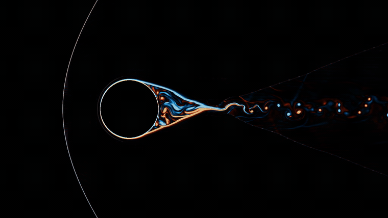

# machmallow 🔥🧁

*Soft on the outside, supersonic on the inside.*

A 2D compressible CFD solver (Euler and Navier–Stokes) with block-structured
hybrid CPU/GPU AMR, written from scratch in C++/Metal for Apple Silicon.



<sub>Mach 2 flow over a cylinder — vorticity (icefire) + schlieren, adaptive-mesh, on an Apple M4.</sub>

## Features

- **Schemes**: 2nd-order MUSCL-Hancock with an HLLC Riemann solver; optional
  WENO5 + RK3 (single-gas). Optional centered viscous fluxes for the
  compressible Navier–Stokes equations (Pr = 0.72), including adiabatic
  no-slip walls.
- **AMR**: block-structured patch hierarchy (AMReX-style) of arbitrary depth
  (`amr.levels`). The CPU handles regridding while the GPU computes fluxes on
  every level (all levels share one slot pool). Recursive Berger–Colella
  subcycling (time-interpolated ghosts, pairwise reflux, guaranteed nesting on
  regrid).
- **Immersed solids**: static geometric bodies (circle, rectangle, triangle,
  half-plane, …) masked on the Cartesian grid, treated as reflective slip
  walls — or viscous no-slip walls when viscosity is on. AMR auto-refines the
  body boundary.
- **Multi-physics**: optional two-gas model (mass-fraction transport,
  quasi-conservative Gamma closure) and single-step Arrhenius reaction for
  detonation/deflagration.
- **GPU**: Metal via [metal-cpp](https://developer.apple.com/metal/cpp/),
  shaders compiled at runtime (no Xcode required), zero-copy shared buffers
  (unified memory).
- **Precision**: float32.
- **Output**: VTK (`vtkOverlappingAMR`) for ParaView, plus an optional
  real-time Metal render window.

## Build

```sh
cmake -B build -DCMAKE_BUILD_TYPE=Release
cmake --build build
```

Requirements: macOS 15+, Command Line Tools, CMake ≥ 3.24. No external
dependencies — metal-cpp is vendored under `third_party/`.

## Running a case

The 22 ready-made cases live in `cases/`:

```sh
./build/run cases/sod.ini               # Sod shock tube
./build/run cases/dmr.ini               # Double Mach reflection (hybrid subcycled AMR)
./build/run cases/cylinder_bowshock.ini # Mach 2 bow shock over an immersed cylinder
./build/run cases/shear.ini             # viscous shear layer (Navier–Stokes)
```

Each run writes `vtkOverlappingAMR` frames to the `prefix` set in its
`[output]` section (e.g. `out/sod_run_0001.vthb`). Open them in ParaView, or
render a video with `tools/schlieren_video.py`.

## Creating a new case

**The solver is entirely driven by the `.ini` file — there is no per-case
C++.** A case declares the domain and grid, named primitive states, the
initial condition as *stacked geometric regions*, per-side boundary conditions,
and optional physics / AMR / output. The workflow:

**1. Start from the commented template** (or the closest existing case):

```sh
cp cases/TEMPLATE.ini cases/mycase.ini
```

**2. Edit the sections.** A complete minimal case — a shock tube — is just:

```ini
backend = hybrid          # cpu (reference oracle) | hybrid (Metal GPU)
t_end   = 0.2
cfl     = 0.4

[domain]                  # physical rectangle
x0 = 0
x1 = 1
y0 = 0
y1 = 0.25

[grid]                    # base resolution (multiples of amr.block)
nx = 128
ny = 32

[state.left]              # named primitive states: rho, u, v, p (defaults 1,0,0,1)
rho = 1.0
p   = 1.0

[state.right]
rho = 0.125
p   = 0.1

[ic]                      # a default state, overridden by ordered regions
default  = right
region.1 = halfplane 1 0 0.5 : left   # a*x + b*y < c  ->  x < 0.5 is "left"

[bc]                      # per side
left   = transmissive
right  = transmissive
bottom = transmissive
top    = transmissive

[output]
frames = 4
prefix = out/mycase
```

`#` **and** `;` both begin a comment, so keep **one key per line**. Build up
from here by adding what you need:

- **Regions** stack over the default (applied in order): `halfplane` (incl.
  *moving* shock fronts via `speed`), `band`, `rect`, `circle`, `sinex`; plus
  additive `perturb.N` (sinusoidal, `erf`, hydrostatic).
- **Physics**: `mu = 1e-3` (Navier–Stokes, no-slip walls), a `[species]` block
  + `gas = 2` states (two-gas), a `[reaction]` block (Arrhenius —
  detonation/deflagration), `scheme = weno5` (high-order, single-gas).
- **Immersed bodies**: a `[solid]` section using the same region grammar.
- **AMR**: an `[amr]` block (`levels`, `block`, `tag_threshold`,
  `tag_velocity`, `subcycle`, `regrid_every`).
- **Boundaries**: `transmissive`, `reflective`, `inflow <state>`, `periodic`
  (per axis), segmentable, and `analytic` — which re-evaluates the regions at
  time *t* in the ghosts (an exact moving-shock inflow in one line).

**3. Check the config** — prints the effective settings and flags unknown keys:

```sh
./build/run --check cases/mycase.ini
```

**4. Run it:**

```sh
./build/run cases/mycase.ini
```

**5. View the result** — open `out/mycase_*.vthb` in ParaView, or render:

```sh
python3 tools/schlieren_video.py --prefix out/mycase --full
```

`./build/run --list` prints the full grammar (every section, key, region type
and BC). The exhaustive reference is
[`docs/CASE_FORMAT.md`](docs/CASE_FORMAT.md), and
[`docs/GUIDE.md`](docs/GUIDE.md) walks through a case in 10 minutes.

## Documentation

- [`docs/GUIDE.md`](docs/GUIDE.md) — user guide: set up a case in 10 min, read
  the log, work with the output.
- [`docs/CASE_FORMAT.md`](docs/CASE_FORMAT.md) — exhaustive `.ini` case-file
  reference.
- [`docs/ARCHITECTURE.md`](docs/ARCHITECTURE.md) — code architecture (layers,
  AMR, hybrid CPU/GPU; Mermaid diagrams).
- [`docs/NUMERICS.md`](docs/NUMERICS.md) — numerical methods (equations, HLLC,
  MUSCL/WENO5, Berger–Colella AMR).
- [`docs/DEVELOPER.md`](docs/DEVELOPER.md) — developer guide: contributing,
  validation discipline, conventions.
- [`docs/VALIDATION.md`](docs/VALIDATION.md) — verification & validation:
  order of accuracy, conservation, CPU/GPU lock-step, vs exact solutions and
  experiments (with numbers).

## Performance (Apple M4, 10-core GPU, 16 GB)

Double Mach Reflection, 2-level AMR, t = 0.2, CFL 0.4 (`dmr_amr`):

| Finest resolution | Steps | Time | Throughput | Work vs uniform |
|---|---|---|---|---|
| 1/256 (coarse 512×128) | 2706 | ~1.8–2.8 s | 86–135 Mcell/s | 34 % |
| 1/512 (coarse 1024×256) | 5624 | ~9.7 s | ~180 Mcell/s | 30 % |

Breakdown of a hybrid step (1/512): GPU ~80 % (compute + 1 sync/step), ghost
fill ~10 %, regrid ~6 %, reflux + restriction ~4 %. Optimal block size: 8
coarse cells. Expect run-to-run variance on Apple Silicon (GPU frequency
governor): ±30 % on small cases.

Reference points: uniform 2D GPU solver ~300 Mcell/s (≈10× single-thread CPU);
hybrid AMR ≈4× single-thread CPU AMR at equal resolution.

## Validation

Sod shock tubes 1D/2D (vs exact Riemann solution), Double Mach Reflection
(Woodward & Colella 1984), viscous shear layer (vs exact erf profile), Blasius
boundary layer, oblique-shock wedge, and immersed-body cases. The CPU
validation harnesses run in CI on every push (see `.github/workflows/ci.yml`).
Development follows a strict CPU/GPU lock-step discipline (the CPU path is the
reference oracle).

📊 **[`vv/`](vv/README.md) — verification & validation figures** (computed vs
exact/theory, reproducible with `python3 vv/generate.py`). The full
quantitative gate list is in [`docs/VALIDATION.md`](docs/VALIDATION.md).

## Roadmap

Milestones and planned work (multi-level AMR, WENO, cut-cells, real-time
rendering, …) are tracked in [ROADMAP.md](ROADMAP.md).

## License

[MIT](LICENSE) © Florian Hermet. Vendored [metal-cpp](third_party/metal-cpp)
is licensed by Apache under its own terms (see
`third_party/metal-cpp/LICENSE.txt`).
