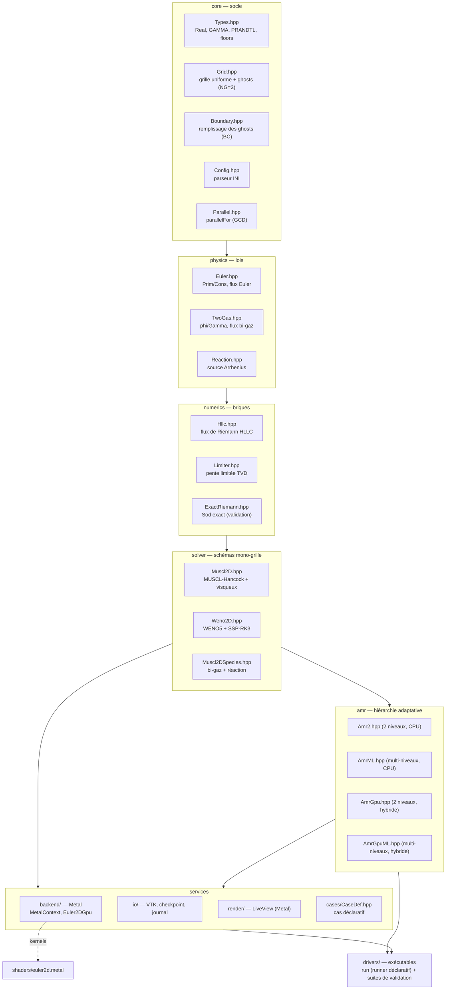
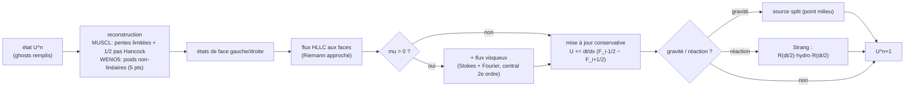
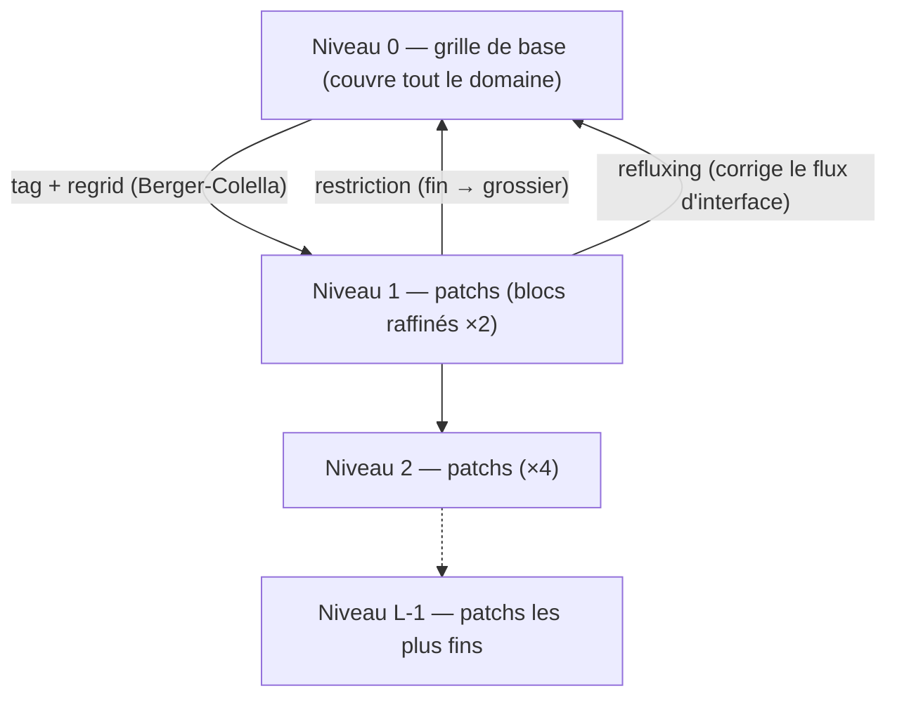
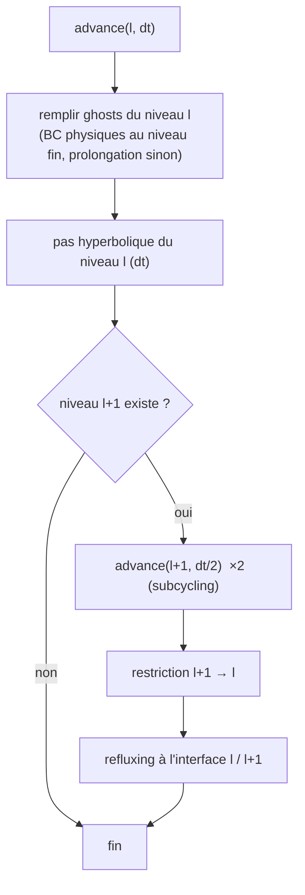
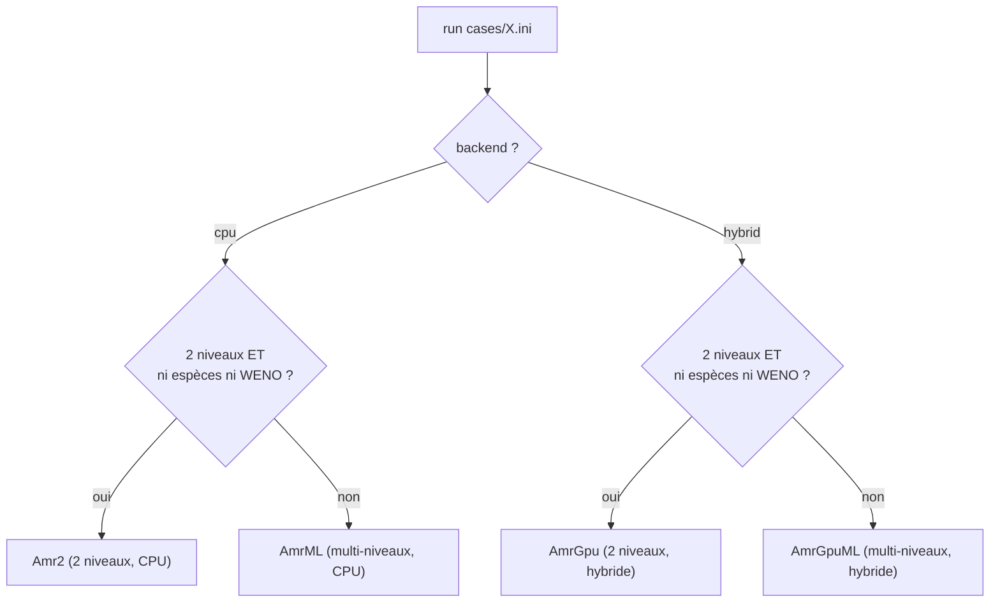
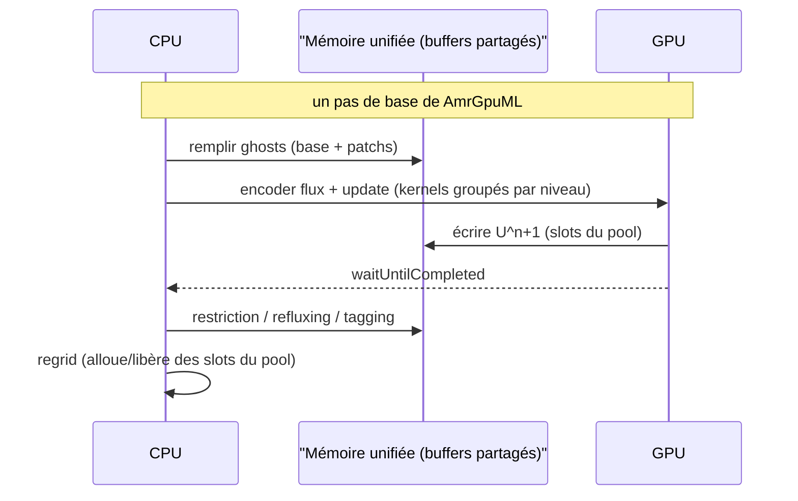
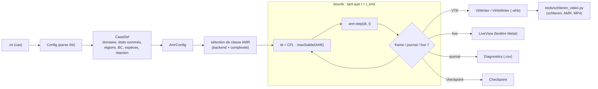
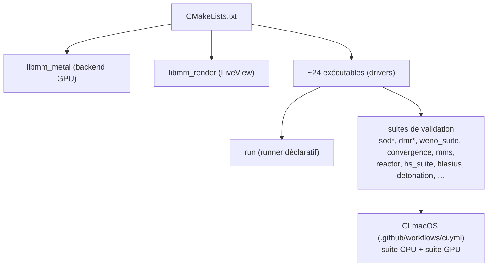

# Architecture de machmallow

`machmallow` est un solveur CFD **2D compressible** (Euler + Navier-Stokes)
à **AMR block-structured hybride CPU/GPU**, écrit *from scratch* en C++20 +
metal-cpp, ciblant Apple Silicon (un seul Mac, GPU Metal, mémoire unifiée).
Tout est en **float32** (`Real = float`) — Metal n'a pas de `double`, et le
CPU partage le type pour un lock-step bit-à-bit avec le GPU.

Principes directeurs : **lisibilité du code**, **validation quantitative à
chaque étape**, et une **UX déclarative** (un cas = un fichier `.ini`).

---

## 1. Vue en couches

Le code est organisé en couches à dépendances strictement descendantes :
chaque couche n'inclut que les couches au-dessus d'elle.

Le GPU (couche `backend`) n'est tiré que par `AmrGpu`, `AmrGpuML` et
`LiveView`. Les classes CPU (`Amr2`, `AmrML`) et tous les schémas
mono-grille en sont indépendants — d'où le **lock-step CPU/GPU** : la même
physique tourne des deux côtés et se compare bit-à-bit.

---

## 2. Structures de données fondamentales

| Type | Rôle |
|---|---|
| `Real` (= `float`) | partout — fp32 imposé par Metal |
| `Prim {rho,u,v,p}` | variables primitives |
| `Cons {rho,mx,my,E}` | variables conservatives (état stocké) |
| `Grid` | grille uniforme + `NG=3` rangées de ghosts ; `idx(i,j)`, `xc(i)`, `yc(j)` |
| `AmrConfig` | paramètres AMR (niveaux, block, seuils de tag, viscosité, gravité, schéma, espèces, réaction, cap du pool) |

La grille stocke un tableau plat de `Cons` (interieur `nx×ny` entouré de
`NG` ghosts de chaque côté). Les cas bi-gaz ajoutent un scalaire
`(phi=rho·Y, Gamma)` par cellule.

---

## 3. Schémas numériques (mono-grille)

Deux schémas, même interface (`stepXXX(Grid&, dt, scratch, ...)`), choisis
par `scheme = muscl | weno5` dans le `.ini`.

- **`Muscl2D`** : MUSCL-Hancock prédicteur-correcteur + flux HLLC ; flux
  visqueux central optionnel (`mu>0`) ; source de gravité split. C'est le
  schéma par défaut, le plus rapide.
- **`Weno2D`** : reconstruction WENO5 (Jiang-Shu) sur états de face + HLLC,
  intégration temporelle SSP-RK3 (3 étages). Ordre élevé en régime lisse.
- **`Muscl2DSpecies`** : variante bi-gaz (transport quasi-conservatif de
  `Gamma` via la vitesse de contact HLLC) + chemin réactif (`react()`
  intègre la variable de progrès λ par RK4 sous-cyclé, l'énergie suit le
  dégagement de chaleur).

> Vérification : `convergence` mesure l'ordre Euler (onde d'entropie ~5
> WENO, vortex ~2) ; `mms` (solutions manufacturées) vérifie l'opérateur
> Navier-Stokes visqueux à l'ordre 2 (cf. `docs`/ROADMAP).

---

## 4. AMR — raffinement adaptatif block-structured

Schéma de **Berger-Colella** : des *patchs* carrés (blocs de `blockC`
cellules, raffinés d'un ratio 2) se posent récursivement là où un critère
de raffinement (gradient de densité, saut de vitesse) le demande. Chaque
niveau avance à son propre pas de temps (**subcycling**), et la
conservation aux interfaces grossier/fin est restaurée par **refluxing**.

L'avance d'un pas est **récursive avec subcycling** : avancer le niveau `l`
d'un pas `dt_l`, puis avancer le niveau `l+1` de deux demi-pas `dt_l/2`,
remplir ses ghosts par prolongation θ-blendée depuis `l`, restreindre et
refluxer en remontant.

### Quatre implémentations, une sélection automatique

Le runner choisit la classe selon `backend` et la complexité du cas :

`Amr2`/`AmrGpu` sont des chemins rapides à 2 niveaux ; `AmrML`/`AmrGpuML`
gèrent une profondeur arbitraire, le bi-gaz, WENO5 et la réaction. Les
versions GPU sont des miroirs *bit-identiques* des versions CPU (gates de
lock-step dans `mlgpu_amr`, `dmr_amr`, etc.).

---

## 5. Hybride CPU / GPU

Sur Apple Silicon la **mémoire est unifiée** : les buffers Metal
(`StorageModeShared`) sont vus à la même adresse par le CPU et le GPU,
**sans copie**. Le partage du travail :

- **GPU** : la boucle chaude — flux, mise à jour, dt (réduction) — sur la
  grille de base et chaque niveau de patchs, en dispatches groupés (un par
  niveau et par sous-pas), via les kernels de `shaders/euler2d.metal`.
- **CPU** : la comptabilité — remplissage des ghosts, tagging, regridding,
  restriction, refluxing — *en place* dans les mêmes buffers.

Tous les patchs de tous les niveaux vivent dans **un seul pool de slots**
(forme de patch identique à toute profondeur). Le pool a une **capacité
configurable** (`amr.max_patches`, par défaut dimensionnée sur ~1/8 du
working set du device) ; sa saturation lève une erreur claire et
actionnable (cf. `Euler2DGpu` / `AmrGpuML`).

`Euler2DGpu` encapsule le device Metal, la compilation des kernels et les
pipelines (MUSCL, WENO, espèces, réaction). `MetalContext` détient le
`device`, la `queue` et le cache de librairies.

---

## 6. Pipeline d'exécution déclaratif (`run`)

`run` est le point d'entrée principal : il transforme un `.ini` en
simulation, sans C++ par cas.

`CaseDef` est entièrement déclaratif : états nommés (avec états post-choc
Rankine-Hugoniot dérivés), régions géométriques (`halfplane`, `circle`,
`band`, `rect`, `sinex`) avec fronts mobiles, perturbations, et BC par côté
(`transmissive`, `reflective`, `noslip`, `analytic`, `inflow`, avec split
`if x < … else …`). Les ghosts `analytic` réévaluent la pile de régions au
temps `t` — la BC exacte du choc mobile du DMR sort gratuitement de la même
description que l'IC.

---

## 7. Services : E/S, rendu, diagnostics

- **`io/VtiWriter` & `VthbWriter`** : sortie VTK ImageData (`.vti`) et
  vtkOverlappingAMR (`.vthb`, hiérarchie complète) pour ParaView.
- **`io/Diagnostics`** : journal CSV (résidus, masse, nb de cellules/patchs,
  débit) par `diagnostics.every`.
- **`io/Checkpoint`** : reprise (sérialisation de l'état).
- **`render/LiveView`** : vue temps réel — un triangle plein écran dont le
  fragment shader échantillonne **directement** les buffers de simulation
  (zéro copie), avec contours de patchs AMR et auto-échelle de couleur.
- **`tools/schlieren_video.py`** : post-traitement hors-ligne — schlieren
  numérique `|∇ρ|` composé du niveau AMR le plus fin, panneau densité +
  blocs AMR, annotation pédagogique, export MP4.

---

## 8. Build & validation

Chaque ajout fonctionnel vient avec une **porte quantitative** (un driver
qui renvoie PASS/FAIL sur une métrique chiffrée), idéalement un cas
déclaratif, et une couverture CI. Les chemins GPU sont comparés *bit-à-bit*
à leur référence CPU.

---

## 9. Conventions & invariants

- **fp32 partout** (`Real = float`) — Metal n'a pas de `double` ; le CPU
  s'aligne pour le lock-step et le layout `float4` zéro-copie.
- **`NG = 3` ghosts** (requis par le stencil WENO5 ; MUSCL en utilise 2).
- **BC physiques des patchs de bord : toujours au niveau fin**
  (`fillPatchPhysical`) — la prolongation des ghosts grossiers casse la
  cohérence dès qu'une onde touche la frontière.
- **Portes de conservation calibrées sur le plancher d'arrondi fp32 mesuré**
  (~1e-8/pas par patch actif), pas sur une valeur idéale.
- **Non-objectifs** : pas de MPI, pas de modèle de turbulence, pas de
  solveur implicite, pas de généralité « production » — mais une UX de
  niveau industriel *est* un objectif (cf. ROADMAP).

---

*Pour la feuille de route, les jalons (v1.0 → v1.5) et les leçons de
conception, voir [`ROADMAP.md`](../ROADMAP.md).*
