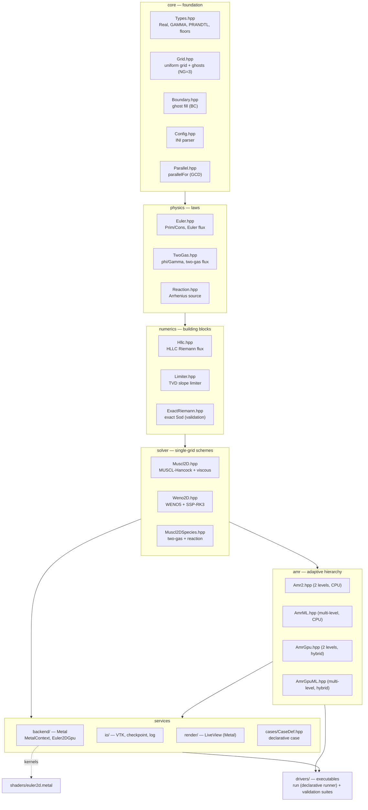
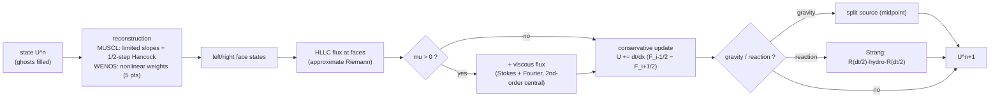
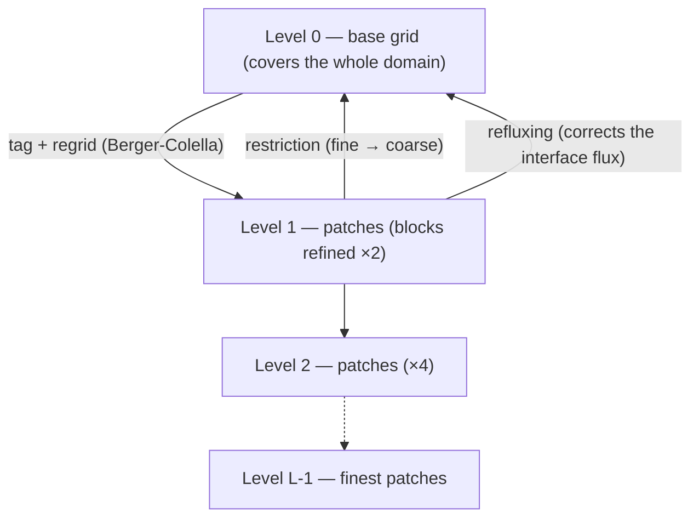
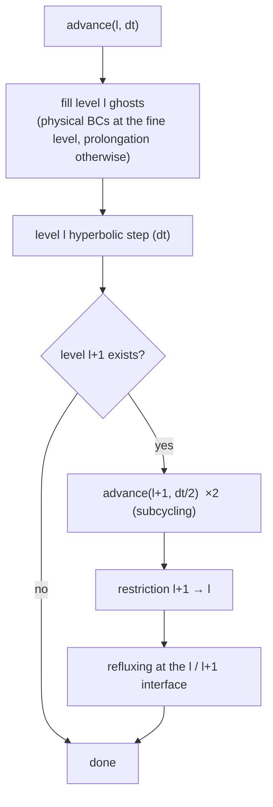
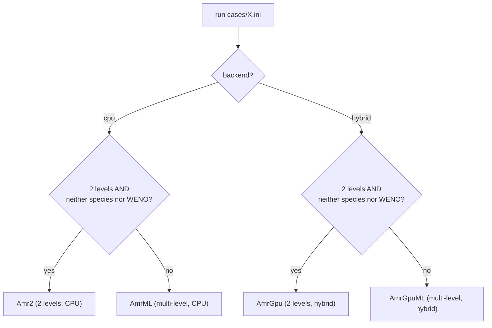
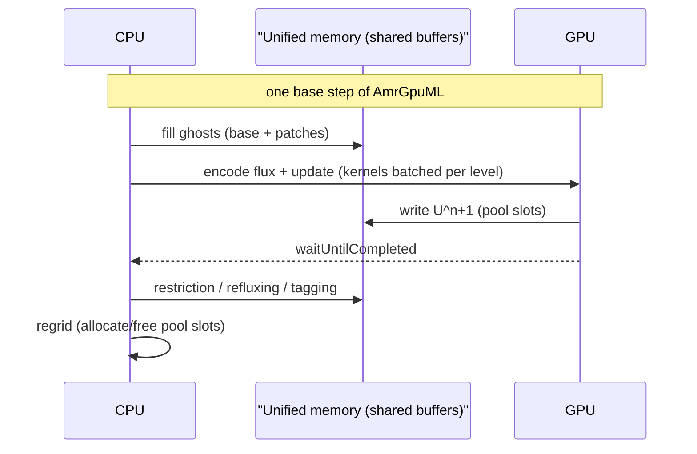
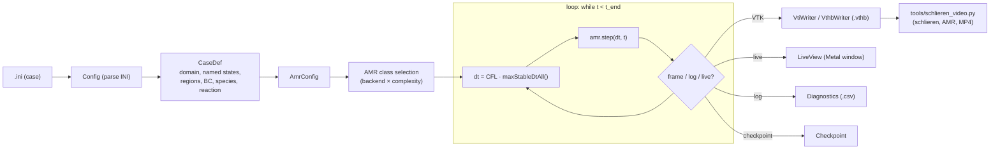
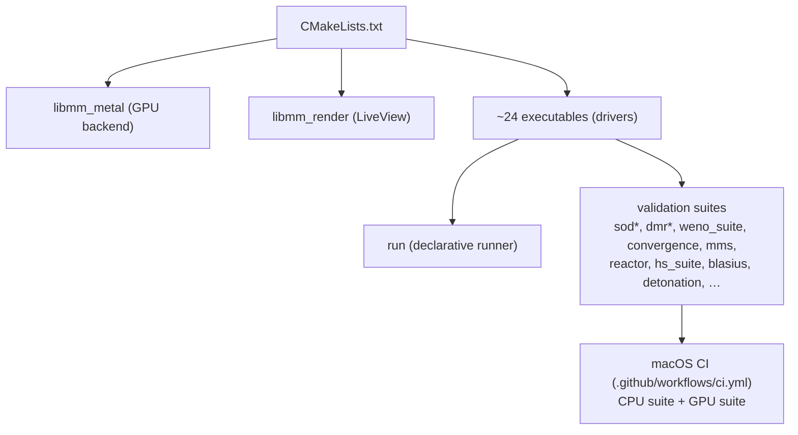

# machmallow architecture

`machmallow` is a **2D compressible** CFD solver (Euler + Navier–Stokes) with
**block-structured hybrid CPU/GPU AMR**, written *from scratch* in C++20 +
metal-cpp, targeting Apple Silicon (a single Mac, Metal GPU, unified memory).
Everything is **float32** (`Real = float`) — Metal has no `double`, and the
CPU shares the type for a bit-for-bit lock-step with the GPU.

Guiding principles: **code readability**, **quantitative validation at every
step**, and a **declarative UX** (one case = one `.ini` file).

---

## 1. Layered view

The code is organized in layers with strictly downward dependencies: each
layer only includes the layers above it.

The GPU (`backend` layer) is only pulled in by `AmrGpu`, `AmrGpuML` and
`LiveView`. The CPU classes (`Amr2`, `AmrML`) and all single-grid schemes are
independent of it — hence the **CPU/GPU lock-step**: the same physics runs on
both sides and is compared bit-for-bit.

---

## 2. Fundamental data structures

| Type | Role |
|---|---|
| `Real` (= `float`) | everywhere — fp32 imposed by Metal |
| `Prim {rho,u,v,p}` | primitive variables |
| `Cons {rho,mx,my,E}` | conservative variables (stored state) |
| `Grid` | uniform grid + `NG=3` ghost rows; `idx(i,j)`, `xc(i)`, `yc(j)` |
| `AmrConfig` | AMR parameters (levels, block, tag thresholds, viscosity, gravity, scheme, species, reaction, pool cap) |

The grid stores a flat array of `Cons` (an `nx×ny` interior surrounded by `NG`
ghosts on each side). Two-gas cases add a `(phi=rho·Y, Gamma)` scalar per
cell.

---

## 3. Numerical schemes (single-grid)

Two schemes, same interface (`stepXXX(Grid&, dt, scratch, ...)`), chosen by
`scheme = muscl | weno5` in the `.ini`.

- **`Muscl2D`**: MUSCL-Hancock predictor-corrector + HLLC flux; optional
  central viscous flux (`mu>0`); split gravity source. The default,
  fastest scheme.
- **`Weno2D`**: WENO5 (Jiang-Shu) reconstruction on face states + HLLC,
  SSP-RK3 time integration (3 stages). High order in smooth regions.
- **`Muscl2DSpecies`**: two-gas variant (quasi-conservative `Gamma` transport
  via the HLLC contact velocity) + reactive path (`react()` integrates the
  progress variable λ by subcycled RK4, energy follows the heat release).

> Verification: `convergence` measures the Euler order (entropy wave ~5 for
> WENO, vortex ~2); `mms` (manufactured solutions) verifies the viscous
> Navier–Stokes operator at order 2 (see `docs`/ROADMAP).

---

## 4. AMR — block-structured adaptive refinement

**Berger-Colella** scheme: square *patches* (blocks of `blockC` cells,
refined by a ratio of 2) recursively cover the regions flagged by a
refinement criterion (density gradient, velocity jump). Each level advances at
its own time step (**subcycling**), and conservation at coarse/fine
interfaces is restored by **refluxing**.

Advancing one step is **recursive with subcycling**: advance level `l` by one
step `dt_l`, then advance level `l+1` by two half-steps `dt_l/2`, fill its
ghosts by θ-blended prolongation from `l`, restrict and reflux on the way
back up.

### Four implementations, one automatic selection

The runner picks the class based on `backend` and case complexity:

`Amr2`/`AmrGpu` are fast 2-level paths; `AmrML`/`AmrGpuML` handle arbitrary
depth, two-gas, WENO5 and reaction. The GPU versions are *bit-identical*
mirrors of the CPU versions (lock-step gates in `mlgpu_amr`, `dmr_amr`, etc.).

---

## 5. Hybrid CPU / GPU

On Apple Silicon the **memory is unified**: Metal buffers
(`StorageModeShared`) are seen at the same address by CPU and GPU, **without a
copy**. The work split:

- **GPU**: the hot loop — fluxes, update, dt (reduction) — on the base grid
  and each patch level, in batched dispatches (one per level and per
  substep), via the kernels in `shaders/euler2d.metal`.
- **CPU**: the bookkeeping — ghost fill, tagging, regridding, restriction,
  refluxing — *in place* in the same buffers.

All patches of all levels live in **a single slot pool** (identical patch
shape at any depth). The pool has a **configurable capacity**
(`amr.max_patches`, by default sized to ~1/8 of the device working set); its
exhaustion raises a clear, actionable error (see `Euler2DGpu` / `AmrGpuML`).

`Euler2DGpu` wraps the Metal device, the kernel compilation and the pipelines
(MUSCL, WENO, species, reaction). `MetalContext` holds the `device`, the
`queue` and the library cache.

---

## 6. Declarative execution pipeline (`run`)

`run` is the main entry point: it turns a `.ini` into a simulation, with no
per-case C++.

`CaseDef` is fully declarative: named states (with derived Rankine-Hugoniot
post-shock states), geometric regions (`halfplane`, `circle`, `band`, `rect`,
`sinex`) with moving fronts, perturbations, and per-side BCs (`transmissive`,
`reflective`, `noslip`, `analytic`, `inflow`, with `if x < … else …` split).
The `analytic` ghosts re-evaluate the region stack at time `t` — the DMR's
exact moving-shock BC falls out for free from the same description as the IC.

---

## 7. Services: I/O, rendering, diagnostics

- **`io/VtiWriter` & `VthbWriter`**: VTK ImageData (`.vti`) and
  vtkOverlappingAMR (`.vthb`, full hierarchy) output for ParaView.
- **`io/Diagnostics`**: CSV log (residuals, mass, cell/patch counts,
  throughput) every `diagnostics.every`.
- **`io/Checkpoint`**: resume (state serialization).
- **`render/LiveView`**: real-time view — a full-screen triangle whose
  fragment shader samples the simulation buffers **directly** (zero copy),
  with AMR patch outlines and auto color scale.
- **`tools/schlieren_video.py`**: offline post-processing — numerical
  schlieren `|∇ρ|` composited from the finest AMR level, density + AMR-blocks
  panel, pedagogical annotation, MP4 export.

---

## 8. Build & validation

Every functional addition comes with a **quantitative gate** (a driver that
returns PASS/FAIL on a numeric metric), ideally a declarative case, and CI
coverage. The GPU paths are compared *bit-for-bit* to their CPU reference.

---

## 9. Conventions & invariants

- **fp32 everywhere** (`Real = float`) — Metal has no `double`; the CPU aligns
  for the lock-step and the zero-copy `float4` layout.
- **`NG = 3` ghosts** (required by the WENO5 stencil; MUSCL uses 2).
- **Physical BCs of edge patches: always at the fine level**
  (`fillPatchPhysical`) — prolongating coarse ghosts breaks consistency as
  soon as a wave touches the boundary.
- **Conservation gates calibrated on the measured fp32 rounding floor**
  (~1e-8/step per active patch), not on an ideal value.
- **Non-goals**: no MPI, no turbulence model, no implicit solver, no
  "production" generality — but an industrial-grade UX *is* a goal (see
  ROADMAP).

---

*For the roadmap, the milestones (v1.0 → v1.5) and the design lessons, see
[`ROADMAP.md`](../ROADMAP.md).*
