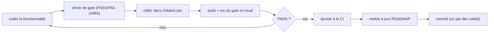

# Guide développeur

Comment contribuer au code : où poser quoi, la discipline de validation,
les conventions et les pièges. Voir [`docs/ARCHITECTURE.md`](ARCHITECTURE.md)
pour la vue d'ensemble et [`docs/NUMERICS.md`](NUMERICS.md) pour les schémas.

---

## 1. Où va le code

Couches à dépendances descendantes (n'inclure que vers le haut) :

| Dossier | Rôle | Dépend du GPU ? |
|---|---|---|
| `core/` | types, grille, ghosts, INI, parallel | non |
| `physics/` | Euler, bi-gaz, réaction | non |
| `numerics/` | HLLC, limiteur, Riemann exact | non |
| `solver/` | schémas mono-grille (MUSCL, WENO5, espèces) | non |
| `amr/` | hiérarchie AMR (Amr2/AmrML CPU ; AmrGpu/AmrGpuML hybride) | hybride seulement |
| `backend/` | Metal (MetalContext, Euler2DGpu) | oui |
| `io/`, `render/` | VTK/checkpoint/journal ; vue live | render : oui |
| `cases/` | `CaseDef` (cas déclaratif) | non |
| `drivers/` | exécutables (runner `run` + suites de validation) | selon le driver |
| `shaders/` | kernels Metal (`euler2d.metal`, `render.metal`) | — |

Tout est en **headers** (`.hpp`) sauf le backend Metal ; les drivers sont
les seuls `.cpp` (avec `MetalContext.cpp`).

---

## 2. Discipline de validation (la règle d'or)

> Toute addition fonctionnelle vient avec une **porte quantitative**, et
> on **commite chaque développement fini ET validé**.

Pour chaque fonctionnalité :

1. **Une porte quantitative** : un driver qui renvoie `PASS`/`FAIL` (exit
   0/1) sur une métrique chiffrée (erreur L1, ordre observé, dérive de
   masse, lock-step CPU/GPU…). Pas de « ça a l'air bon ».
2. **Idéalement un cas déclaratif** (`.ini`) pour l'usage.
3. **Couverture CI** (suite CPU ou GPU).
4. **ROADMAP à jour** dans le même commit.
5. **Commit** sur `main`, sans attribution d'outil.



---

## 3. Recette : ajouter un driver / une porte

**a) Écrire `src/drivers/moncas.cpp`** — calcule une métrique et renvoie
`0` (PASS) ou `1` (FAIL) :
```cpp
int main() {
    // ... monter un cas, mesurer ...
    const bool ok = erreur < tol;
    std::printf("%s (err %.3e, tol %.3e)\n", ok ? "PASS" : "FAIL", err, tol);
    return ok ? 0 : 1;
}
```

**b) Déclarer la cible dans `CMakeLists.txt`** — deux patrons :
```cmake
# CPU pur (core/physics/numerics/solver/amr CPU) :
add_executable(moncas src/drivers/moncas.cpp)
target_include_directories(moncas PRIVATE src)

# Besoin du GPU (AmrGpu/AmrGpuML/Euler2DGpu) :
add_executable(moncas src/drivers/moncas.cpp)
target_link_libraries(moncas PRIVATE mm_metal)   # apporte src en include
# + mm_render si vue live
```
Puis reconfigurer : `cmake -B build && cmake --build build --target moncas`.

> ⚠️ **Toujours configurer/builder dans `build/`** (`cmake -B build …`).
> Lancer `cmake .` à la racine pollue le repo avec des artefacts in-source.

**c) Ajouter à la CI** (`.github/workflows/ci.yml`) — le build compile
tout ; il suffit d'ajouter la ligne d'exécution dans la bonne suite :
```yaml
# suite CPU (machine sans GPU)        # suite GPU (runner Metal)
./build/moncas                         ./build/moncas
```

**d) Mettre à jour `ROADMAP.md`** et **commiter**.

---

## 4. Conventions & invariants

- **`Real = float` partout** — Metal n'a pas de `double`. Le CPU s'aligne
  pour le lock-step bit-à-bit et le layout `float4` zéro-copie.
- **`NG = 3` ghosts** (`core/Grid.hpp`) — requis par WENO5 ; MUSCL en
  utilise 2. Tout consommateur de la mémoire (y compris le **rendu**) doit
  respecter `NG` : la vérif bit-identique doit couvrir *tous* les
  consommateurs (un bug de rendu hardcodé à `NG=2` l'a rappelé).
- **Lock-step CPU/GPU** : chaque chemin GPU a une référence CPU
  bit-identique. Les classes CPU (`Amr2`, `AmrML`) ne touchent pas Metal.
- **BC physiques des patchs de bord : au niveau fin** (`fillPatchPhysical`)
  — la prolongation des ghosts grossiers casse la cohérence aux frontières.
- **Portes de conservation** calibrées sur le **plancher d'arrondi fp32
  mesuré** (~1e-8/pas par patch actif), pas sur une valeur idéale ; le test
  discriminant est le contraste avec/sans refluxing.
- **Cellules carrées** : `nx/ny = (x1-x0)/(y1-y0)` ; `nx,ny` multiples de
  `amr.block`.
- **Ordre mesuré en régime lisse** : les limiteurs TVD plafonnent à l'ordre
  ~1 aux extrema lisses, le flux de face au point milieu plafonne le
  multi-D près de 2, le plancher fp32 plafonne tout aux grandes N.

---

## 5. Travailler sur le GPU

- Les kernels sont dans `shaders/euler2d.metal`, **compilés au runtime**
  (`MetalContext::compileLibrary`) — pas de Xcode requis.
- `Euler2DGpu` encapsule device/pipelines et expose `enableWeno/Species/
  Reaction`, `step`, `react`, `maxStableDt`. `AmrGpuML` orchestre la
  hiérarchie (un **pool de slots** unique pour tous les patchs).
- **Mémoire unifiée** : les buffers sont `StorageModeShared` ; le CPU lit/
  écrit les mêmes octets que le GPU, sans copie. Toute modification du
  layout doit rester cohérente des deux côtés (et avec le rendu).
- Le pool a une **capacité** (`amr.max_patches`, défaut ~1/8 du working
  set) ; sa saturation lève une erreur actionnable, pas un crash.

Les quatre classes AMR et leur sélection automatique :
`Amr2`/`AmrGpu` (2 niveaux rapides) ; `AmrML`/`AmrGpuML` (profondeur
arbitraire, bi-gaz, WENO5, réaction). Une modif physique se fait d'abord
côté CPU (`AmrML`), puis on porte le kernel GPU et on verrouille le
lock-step.

---

## 6. Tester en local

```sh
cmake --build build -j                 # tout
./build/<gate>                          # une porte (exit 0 = PASS)
for c in cases/*.ini; do ./build/run --check "$c"; done   # cas parsables
```

La CI (`.github/workflows/ci.yml`) rejoue : une **suite CPU** (sod*, dmr*,
weno_suite, convergence, mms, reactor, blasius, casedef_test, `--check` de
tous les cas…) et une **suite GPU** (dmr_gpu, mlgpu_amr, detonation,
hs_suite, lock-steps…). Les études lourdes (benchmark, déflagration) sont
manuelles (compilées en CI, pas exécutées).

---

## 7. Ce qui est hors périmètre

Pas de MPI / multi-machine, pas de modèle de turbulence (RANS/LES), pas de
solveur implicite global, pas de généralité « production » (maillages non
structurés). En revanche, une **UX de niveau industriel** *est* un objectif
(simplicité d'usage, lisibilité du code). Voir [`ROADMAP.md`](../ROADMAP.md).
