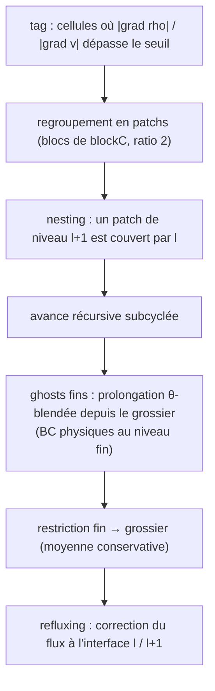

# Méthodes numériques

Détail des équations et schémas implémentés. Voir
[`docs/ARCHITECTURE.md`](ARCHITECTURE.md) pour l'organisation du code et
[`ROADMAP.md`](../ROADMAP.md) pour les résultats de validation.

Tout est en **2D**, **float32**, sur grille cartésienne (cellules carrées).

---

## 1. Équations

Forme conservative des équations de Navier-Stokes compressibles :

$$\partial_t \mathbf{U} + \partial_x \mathbf{F} + \partial_y \mathbf{G}
= \partial_x \mathbf{F}_v + \partial_y \mathbf{G}_v + \mathbf{S}$$

avec $\mathbf{U} = (\rho,\ \rho u,\ \rho v,\ E)^\top$, les flux d'Euler

$$\mathbf{F} = \begin{pmatrix}\rho u\\ \rho u^2 + p\\ \rho u v\\ (E+p)u\end{pmatrix},\quad
\mathbf{G} = \begin{pmatrix}\rho v\\ \rho u v\\ \rho v^2 + p\\ (E+p)v\end{pmatrix},$$

et la loi d'état du gaz parfait

$$E = \frac{p}{\gamma-1} + \tfrac12\rho(u^2+v^2),\qquad T = \frac{p}{\rho}\ (R=1).$$

`Euler.hpp` définit `Prim {rho,u,v,p}`, `Cons {rho,mx,my,E}`, les
conversions et `fluxX`/`fluxY`. $\mathbf{F}_v,\mathbf{G}_v$ (visqueux) et
$\mathbf{S}$ (sources : gravité, réaction) sont détaillés plus bas.

---

## 2. Volumes finis

On stocke les **moyennes de cellule** $\mathbf{U}_{ij}$. La mise à jour
conservative sur un pas $\Delta t$ :

$$\mathbf{U}_{ij}^{n+1} = \mathbf{U}_{ij}^{n}
- \frac{\Delta t}{\Delta x}\big(\hat{\mathbf F}_{i+\frac12,j} - \hat{\mathbf F}_{i-\frac12,j}\big)
- \frac{\Delta t}{\Delta y}\big(\hat{\mathbf G}_{i,j+\frac12} - \hat{\mathbf G}_{i,j-\frac12}\big)$$

Les flux numériques de face $\hat{\mathbf F}$ viennent d'un solveur de
Riemann (HLLC) appliqué aux états reconstruits de part et d'autre de la
face. Le traitement 2D est **directionnel** (flux de face au point milieu,
indépendamment en x et y).

---

## 3. Solveur de Riemann HLLC (`numerics/Hllc.hpp`)

HLLC modélise l'éventail de Riemann par **trois ondes** (gauche, contact,
droite) et restaure l'onde de contact que HLL écrase (essentiel pour les
discontinuités de contact et les couches de cisaillement).

Estimation des vitesses d'onde (Toro, basée pression) :

$$S_L = u_L - c_L\,q_L,\quad S_R = u_R + c_R\,q_R,$$

$$S_* = \frac{p_R - p_L + \rho_L u_L (S_L - u_L) - \rho_R u_R (S_R - u_R)}
{\rho_L (S_L - u_L) - \rho_R (S_R - u_R)},$$

où $q_K$ vaut 1 en détente et $\sqrt{1+\frac{\gamma+1}{2\gamma}(p^*/p_K-1)}$
en choc ($p^*$ : pression d'étoile estimée). Le flux retenu dépend des
signes :

$$\hat{\mathbf F} = \begin{cases}
\mathbf F(W_L) & 0 \le S_L\\
\mathbf F_L^* & S_L \le 0 \le S_*\\
\mathbf F_R^* & S_* \le 0 \le S_R\\
\mathbf F(W_R) & S_R \le 0
\end{cases}$$

avec $\mathbf F_K^* = \mathbf F(W_K) + S_K(\mathbf U_K^* - \mathbf U_K)$.

---

## 4. MUSCL-Hancock + HLLC (`solver/Muscl2D.hpp`, défaut)

Schéma **ordre 2** en espace et en temps, en trois temps :

1. **Reconstruction** : pente limitée TVD par cellule (`Limiter.hpp`),
   $\Delta\mathbf U_{ij}$, donnant des états de face gauche/droite.
2. **Prédicteur de Hancock** : on avance ces états d'un **demi-pas** par
   l'équation locale (évaluation des flux sur les faces reconstruites),
   ce qui donne les états centrés en temps $\mathbf U^{n+1/2}$. Garde-fou
   de **positivité** : si une face devient non physique (ρ ≤ 0 ou énergie
   interne ≤ 0), la cellule retombe à l'ordre 1.
3. **Correcteur** : flux HLLC entre faces voisines, puis mise à jour
   conservative.

C'est le schéma par défaut (`scheme = muscl`), le plus rapide.

---

## 5. WENO5 + SSP-RK3 (`solver/Weno2D.hpp`)

`scheme = weno5` : reconstruction **WENO5 (Jiang-Shu)** des états de face
(poids non linéaires sur 5 points, montant à l'ordre 5 en régime lisse, se
réduisant proprement près des discontinuités) + flux HLLC, intégrée par
**SSP-RK3** (3 étages) :

$$\mathbf U^{(1)} = \mathbf U^n + \Delta t\,L(\mathbf U^n)$$
$$\mathbf U^{(2)} = \tfrac34 \mathbf U^n + \tfrac14\big(\mathbf U^{(1)} + \Delta t\,L(\mathbf U^{(1)})\big)$$
$$\mathbf U^{n+1} = \tfrac13 \mathbf U^n + \tfrac23\big(\mathbf U^{(2)} + \Delta t\,L(\mathbf U^{(2)})\big)$$

Nécessite `NG = 3` rangées de ghosts (stencil large).

> En 2D, l'ordre réalisé est plafonné près de 2 par le flux de face au
> point milieu (quadrature 1 point) ; l'ordre 5 n'apparaît que sur du
> lisse aligné à la grille. WENO garde surtout une **constante d'erreur
> bien plus petite** (vortex ~6× moins dissipé que MUSCL).

---

## 6. Termes visqueux (`addViscousFluxes`)

Navier-Stokes compressible, hypothèse de Stokes (viscosité de volume
nulle, $\lambda = -\tfrac23\mu$), conduction de Fourier :

$$\tau_{xx} = \mu\big(\tfrac43 u_x - \tfrac23 v_y\big),\quad
\tau_{yy} = \mu\big(\tfrac43 v_y - \tfrac23 u_x\big),\quad
\tau_{xy} = \mu(u_y + v_x),$$

$$\mathbf F_v = \big(0,\ \tau_{xx},\ \tau_{xy},\ u\tau_{xx}+v\tau_{xy} + \kappa\,T_x\big)^\top,$$

avec la conductivité $\kappa = \dfrac{\mu\,\gamma}{(\gamma-1)\,\mathrm{Pr}}$
(Pr = 0.72). Les gradients aux faces sont en **différences centrées 2e
ordre** (normales 2 points, transverses par moyenne 4 points) — d'où un
opérateur visqueux d'**ordre 2** quel que soit le schéma inviscide
(vérifié par MMS, cf. §10).

---

## 6 bis. Corps immergés (masque solide)

Un masque `solid` (1 = solide) retire des cellules de l'écoulement sur la
grille cartésienne (méthode ghost-cell, pas de cellules coupées). Les
cellules solides ne sont ni reconstruites ni mises à jour ; à chaque face
**fluide↔solide** on impose un **mur glissant**.

Le flux de paroi n'est *pas* le HLLC de l'état miroir : pour un écoulement
**normal supersonique** (un > c), l'estimation de vitesse d'onde PVRS de
HLLC garde $S_L = u_L - c_L\,q > 0$ et **décentre tout le flux entrant** —
la paroi fuit et un corps supersonique devient quasi transparent (l'arc de
choc se forme puis se vide). On impose donc le **flux de pression de paroi
exact**

$$\mathbf F_{\text{paroi}} = (0,\ p^\*,\ 0,\ 0)^\top,$$

où $p^\*$ résout $f_W(p^\*) = u_n$ (fonction de pression de Toro : branche
choc si $u_n>0$, détente sinon), par Newton — exact en sub- **et**
supersonique. La paroi ne transporte ni masse ni énergie (glissement : le
flux convectif tangentiel s'annule car la vitesse normale est nulle).
Vérifié exactement sur la réflexion de choc alignée à Ms=2 (post-choc
subsonique) **et Ms=3** (post-choc supersonique, M1≈1.36) — cf.
[`VALIDATION.md`](VALIDATION.md). Sur une face oblique (corps courbe), la
frontière est en **escalier** : qualitativement correct (arc de choc d'un
cylindre), à raffiner par AMR ou cut-cells (cf. roadmap).

---

## 7. Bi-gaz (`physics/TwoGas.hpp`, `solver/Muscl2DSpecies.hpp`)

Modèle à deux gaz parfaits de $\gamma$ différents. On transporte la
fraction massique via $\varphi = \rho Y$ (conservatif) et la fermeture
$\Gamma = 1/(\gamma-1)$ de façon **quasi-conservative**, advectée par la
**vitesse de contact $S_*$** du solveur HLLC — ce qui évite les
oscillations de pression aux interfaces matérielles. La pression se ferme
sur le $\Gamma$ local.

---

## 8. Réaction (`physics/Reaction.hpp`)

Cinétique d'Arrhenius mono-étape sur la variable de progrès $\lambda$ :

$$\frac{d\lambda}{dt} = A\,(1-\lambda)\,e^{-E_a/T}\quad (T \ge T_{ign}),$$

intégrée par **RK4 sous-cyclé adaptatif**. L'énergie est **asservie** au
dégagement de chaleur, $e = e_0 + q(\lambda - \lambda_0)$ (exact, puisque
$de/dt = q\,d\lambda/dt$) — d'où une intégration de $\lambda$ seule,
conservative et insensible aux clampings. Couplage à l'hydrodynamique par
**splitting de Strang** : $R(\tfrac{\Delta t}{2})\cdot \mathcal H(\Delta t)\cdot R(\tfrac{\Delta t}{2})$.

---

## 9. Pas de temps (`maxStableDt`)

Limite advective (CFL) et, en visqueux, limite de diffusion explicite :

$$\Delta t = C\!\cdot\!\min\!\Big(\frac{\Delta x}{|u|+c},\ \frac{\Delta y}{|v|+c}\Big),
\qquad
\Delta t_v = \frac{C/2}{\nu_{\mathrm{eff}}\big(\Delta x^{-2}+\Delta y^{-2}\big)},$$

$$\nu_{\mathrm{eff}} = \frac{\mu}{\rho}\,\max\!\Big(\tfrac43,\ \frac{\gamma}{\mathrm{Pr}}\Big),
\qquad c = \sqrt{\gamma p/\rho},$$

et $\Delta t \leftarrow \min(\Delta t, \Delta t_v)$. En AMR subcyclé, chaque
niveau prend son propre pas (le fin à $\Delta t/2$ par rapport au grossier).

---

## 10. AMR — algorithmes (Berger-Colella)

- **Tagging / regridding** tous les `regrid_every` pas (critères :
  gradient de densité, saut de vitesse) ; patchs carrés de `blockC`
  cellules, ratio de raffinement 2 ; **nesting** garanti.
- **Subcycling** récursif : avancer le niveau $l$ de $\Delta t_l$, puis le
  niveau $l{+}1$ de deux $\Delta t_l/2$.
- **Ghosts** des patchs : prolongation **θ-blendée** en temps depuis le
  niveau grossier ; **les BC physiques de bord sont posées au niveau fin**
  (`fillPatchPhysical`) — sinon la conservation casse dès qu'une onde
  touche la frontière.
- **Restriction** : moyenne conservative fin → grossier.
- **Refluxing** : à l'interface grossier/fin, on remplace le flux grossier
  par la somme des flux fins — restaure la conservation à la machine.

---

## 11. Vérification

| Outil | Ce qu'il vérifie |
|---|---|
| `convergence` | ordre Euler lisse : onde d'entropie (~5 WENO), vortex (~2) ; Sod (~1, discontinuité) |
| `mms` | ordre de l'opérateur **Navier-Stokes** par solutions manufacturées : visqueux ordre 2 (MUSCL 2.10, WENO5 1.97), + source de gravité |
| `casedef_test` | équivalence du système déclaratif aux presets historiques |
| lock-step `mlgpu_amr`, `dmr_amr`… | GPU **bit-identique** au CPU |

Les portes de conservation se calibrent sur le **plancher d'arrondi fp32**
mesuré (~1e-8/pas par patch actif), pas sur une valeur idéale.
