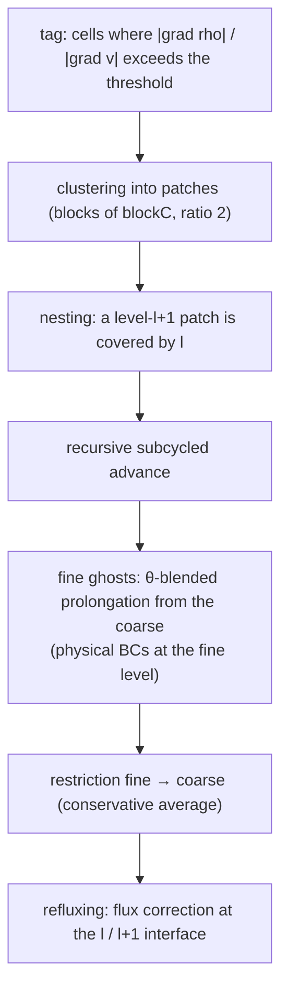

# Numerical methods

Details of the implemented equations and schemes. See
[`docs/ARCHITECTURE.md`](ARCHITECTURE.md) for the code organization and
[`ROADMAP.md`](../ROADMAP.md) for validation results.

Everything is **2D**, **float32**, on a Cartesian grid (square cells).

---

## 1. Equations

Conservative form of the compressible Navier–Stokes equations:

$$\partial_t \mathbf{U} + \partial_x \mathbf{F} + \partial_y \mathbf{G}
= \partial_x \mathbf{F}_v + \partial_y \mathbf{G}_v + \mathbf{S}$$

with $\mathbf{U} = (\rho,\ \rho u,\ \rho v,\ E)^\top$, the Euler fluxes

$$\mathbf{F} = \begin{pmatrix}\rho u\\ \rho u^2 + p\\ \rho u v\\ (E+p)u\end{pmatrix},\quad
\mathbf{G} = \begin{pmatrix}\rho v\\ \rho u v\\ \rho v^2 + p\\ (E+p)v\end{pmatrix},$$

and the ideal-gas equation of state

$$E = \frac{p}{\gamma-1} + \tfrac12\rho(u^2+v^2),\qquad T = \frac{p}{\rho}\ (R=1).$$

`Euler.hpp` defines `Prim {rho,u,v,p}`, `Cons {rho,mx,my,E}`, the conversions
and `fluxX`/`fluxY`. $\mathbf{F}_v,\mathbf{G}_v$ (viscous) and $\mathbf{S}$
(sources: gravity, reaction) are detailed below.

---

## 2. Finite volumes

We store the **cell averages** $\mathbf{U}_{ij}$. The conservative update over
a step $\Delta t$:

$$\mathbf{U}_{ij}^{n+1} = \mathbf{U}_{ij}^{n}
- \frac{\Delta t}{\Delta x}\big(\hat{\mathbf F}_{i+\frac12,j} - \hat{\mathbf F}_{i-\frac12,j}\big)
- \frac{\Delta t}{\Delta y}\big(\hat{\mathbf G}_{i,j+\frac12} - \hat{\mathbf G}_{i,j-\frac12}\big)$$

The numerical face fluxes $\hat{\mathbf F}$ come from a Riemann solver (HLLC)
applied to the states reconstructed on either side of the face. The 2D
treatment is **directional** (midpoint face flux, independently in x and y).

---

## 3. HLLC Riemann solver (`numerics/Hllc.hpp`)

HLLC models the Riemann fan with **three waves** (left, contact, right) and
restores the contact wave that HLL smears out (essential for contact
discontinuities and shear layers).

Wave-speed estimation (Toro, pressure-based):

$$S_L = u_L - c_L\,q_L,\quad S_R = u_R + c_R\,q_R,$$

$$S_* = \frac{p_R - p_L + \rho_L u_L (S_L - u_L) - \rho_R u_R (S_R - u_R)}
{\rho_L (S_L - u_L) - \rho_R (S_R - u_R)},$$

where $q_K$ is 1 in a rarefaction and
$\sqrt{1+\frac{\gamma+1}{2\gamma}(p^*/p_K-1)}$ in a shock ($p^*$: estimated
star pressure). The selected flux depends on the signs:

$$\hat{\mathbf F} = \begin{cases}
\mathbf F(W_L) & 0 \le S_L\\
\mathbf F_L^* & S_L \le 0 \le S_*\\
\mathbf F_R^* & S_* \le 0 \le S_R\\
\mathbf F(W_R) & S_R \le 0
\end{cases}$$

with $\mathbf F_K^* = \mathbf F(W_K) + S_K(\mathbf U_K^* - \mathbf U_K)$.

---

## 4. MUSCL-Hancock + HLLC (`solver/Muscl2D.hpp`, default)

A **2nd-order** scheme in space and time, in three steps:

1. **Reconstruction**: per-cell TVD limited slope (`Limiter.hpp`),
   $\Delta\mathbf U_{ij}$, yielding left/right face states.
2. **Hancock predictor**: advance these states by a **half-step** with the
   local equation (evaluating the fluxes on the reconstructed faces), giving
   the time-centered states $\mathbf U^{n+1/2}$. **Positivity** safeguard: if a
   face becomes non-physical (ρ ≤ 0 or internal energy ≤ 0), the cell falls
   back to first order.
3. **Corrector**: HLLC flux between neighboring faces, then conservative
   update.

This is the default scheme (`scheme = muscl`), the fastest.

---

## 5. WENO5 + SSP-RK3 (`solver/Weno2D.hpp`)

`scheme = weno5`: **WENO5 (Jiang-Shu)** reconstruction of the face states
(nonlinear weights over 5 points, reaching order 5 in smooth regions,
degrading cleanly near discontinuities) + HLLC flux, integrated by **SSP-RK3**
(3 stages):

$$\mathbf U^{(1)} = \mathbf U^n + \Delta t\,L(\mathbf U^n)$$
$$\mathbf U^{(2)} = \tfrac34 \mathbf U^n + \tfrac14\big(\mathbf U^{(1)} + \Delta t\,L(\mathbf U^{(1)})\big)$$
$$\mathbf U^{n+1} = \tfrac13 \mathbf U^n + \tfrac23\big(\mathbf U^{(2)} + \Delta t\,L(\mathbf U^{(2)})\big)$$

Requires `NG = 3` ghost rows (wide stencil).

> In 2D, the realized order is capped near 2 by the midpoint face flux (1-point
> quadrature); order 5 only appears on grid-aligned smooth flow. WENO mainly
> keeps a **much smaller error constant** (vortex ~6× less dissipated than
> MUSCL).

---

## 6. Viscous terms (`addViscousFluxes`)

Compressible Navier–Stokes, Stokes hypothesis (zero bulk viscosity,
$\lambda = -\tfrac23\mu$), Fourier conduction:

$$\tau_{xx} = \mu\big(\tfrac43 u_x - \tfrac23 v_y\big),\quad
\tau_{yy} = \mu\big(\tfrac43 v_y - \tfrac23 u_x\big),\quad
\tau_{xy} = \mu(u_y + v_x),$$

$$\mathbf F_v = \big(0,\ \tau_{xx},\ \tau_{xy},\ u\tau_{xx}+v\tau_{xy} + \kappa\,T_x\big)^\top,$$

with conductivity $\kappa = \dfrac{\mu\,\gamma}{(\gamma-1)\,\mathrm{Pr}}$
(Pr = 0.72). Face gradients use **2nd-order central differences** (2-point
normal, 4-point average for transverse) — hence a viscous operator of **order
2** regardless of the inviscid scheme (verified by MMS, see §11).

---

## 6b. Immersed bodies (solid mask)

A `solid` mask (1 = solid) removes cells from the flow on the Cartesian grid
(ghost-cell method, no cut cells). Solid cells are neither reconstructed nor
updated; at each **fluid↔solid** face a **slip wall** is imposed.

With viscosity (`mu > 0`) the wall becomes **adherent (no-slip)**: in
`addViscousFluxes`, a solid neighbor is replaced by a no-slip ghost (both
velocity components mirrored, ρ/p preserved → adiabatic), so the wall shear
zeroes the tangential velocity (the slip convective flux provides the
pressure). Validated by the Blasius boundary layer on an immersed plate (gate
`immersed_noslip`, profile RMS 0.7 %, Cf 3 %), and ported to GPU (same no-slip
ghosts in the Metal kernels; viscous CPU↔GPU lock-step verified,
`immersed_gpu`).

The (convective) wall flux is *not* the HLLC of the mirror state: for a flow
that is **normal-supersonic** (un > c), HLLC's PVRS wave-speed estimate keeps
$S_L = u_L - c_L\,q > 0$ and **upwinds the entire incoming flux** — the wall
leaks and a supersonic body becomes nearly transparent (the bow shock forms
then drains). We therefore impose the **exact wall-pressure flux**

$$\mathbf F_{\text{wall}} = (0,\ p^\*,\ 0,\ 0)^\top,$$

where $p^\*$ solves $f_W(p^\*) = u_n$ (Toro's pressure function: shock branch
if $u_n>0$, rarefaction otherwise), by Newton — exact in sub- **and**
supersonic. The wall transports neither mass nor energy (slip: the tangential
convective flux vanishes since the normal velocity is zero). Verified exactly
on the aligned shock reflection at Ms=2 (subsonic post-shock) **and Ms=3**
(supersonic post-shock, M1≈1.36) — see [`VALIDATION.md`](VALIDATION.md). On an
oblique face (curved body) the boundary is **staircased**: AMR (`Amr2`, 2
levels) refines it automatically — fluid cells touching a solid are tagged —
in addition to shocks. The AMR chain is mask-aware end to end: per-patch mask,
**restriction** on fluid daughters only, **refluxing** that spares solid
cells, **prolongation** as a constant staircase touching a solid.
**Multi-level** (`AmrML`, arbitrary depth): the same chain at every level, via
a geometric query `solidAt(position)` (the parent of a fine level is a patch,
not the base) — validated at 3 levels (`immersed_amr`). Everything is a no-op
without `[solid]` (the non-solid AMR gates are unchanged), on GPU too
(`AmrGpuML`, per-slot pool mask; 3-level lock-step verified). The **GPU**
(`AmrGpu` hybrid) reproduces this chain exactly: mask in the Metal kernels
(including `wallPressure` ported to MSL), per-slot pool mask, CPU↔GPU
lock-step verified (`immersed_gpu`, discrepancy ~1e-3). Removing the staircase
via cut-cells remains (see roadmap).

---

## 7. Two-gas (`physics/TwoGas.hpp`, `solver/Muscl2DSpecies.hpp`)

A two-ideal-gas model with different $\gamma$. We transport the mass fraction
via $\varphi = \rho Y$ (conservative) and the closure $\Gamma = 1/(\gamma-1)$
**quasi-conservatively**, advected by the HLLC **contact velocity $S_*$** —
which avoids pressure oscillations at material interfaces. Pressure is closed
on the local $\Gamma$.

---

## 8. Reaction (`physics/Reaction.hpp`)

Single-step Arrhenius kinetics on the progress variable $\lambda$:

$$\frac{d\lambda}{dt} = A\,(1-\lambda)\,e^{-E_a/T}\quad (T \ge T_{ign}),$$

integrated by **adaptive subcycled RK4**. Energy is **slaved** to the heat
release, $e = e_0 + q(\lambda - \lambda_0)$ (exact, since
$de/dt = q\,d\lambda/dt$) — hence integrating $\lambda$ alone, conservative
and insensitive to clamping. Coupling to the hydrodynamics by **Strang
splitting**:
$R(\tfrac{\Delta t}{2})\cdot \mathcal H(\Delta t)\cdot R(\tfrac{\Delta t}{2})$.

---

## 9. Time step (`maxStableDt`)

Advective (CFL) limit and, when viscous, an explicit diffusion limit:

$$\Delta t = C\!\cdot\!\min\!\Big(\frac{\Delta x}{|u|+c},\ \frac{\Delta y}{|v|+c}\Big),
\qquad
\Delta t_v = \frac{C/2}{\nu_{\mathrm{eff}}\big(\Delta x^{-2}+\Delta y^{-2}\big)},$$

$$\nu_{\mathrm{eff}} = \frac{\mu}{\rho}\,\max\!\Big(\tfrac43,\ \frac{\gamma}{\mathrm{Pr}}\Big),
\qquad c = \sqrt{\gamma p/\rho},$$

and $\Delta t \leftarrow \min(\Delta t, \Delta t_v)$. In subcycled AMR each
level takes its own step (the fine one at $\Delta t/2$ relative to the coarse).

---

## 10. AMR — algorithms (Berger-Colella)

- **Tagging / regridding** every `regrid_every` steps (criteria: density
  gradient, velocity jump); square patches of `blockC` cells, refinement
  ratio 2; **nesting** guaranteed.
- **Recursive subcycling**: advance level $l$ by $\Delta t_l$, then level
  $l{+}1$ by two $\Delta t_l/2$.
- Patch **ghosts**: **θ-blended** prolongation in time from the coarse level;
  **physical edge BCs are set at the fine level** (`fillPatchPhysical`) —
  otherwise conservation breaks as soon as a wave touches the boundary.
- **Restriction**: conservative fine → coarse average.
- **Refluxing**: at the coarse/fine interface, the coarse flux is replaced by
  the sum of the fine fluxes — restores conservation to machine precision.

---

## 11. Verification

| Tool | What it checks |
|---|---|
| `convergence` | smooth Euler order: entropy wave (~5 WENO), vortex (~2); Sod (~1, discontinuity) |
| `mms` | order of the **Navier–Stokes** operator via manufactured solutions: viscous order 2 (MUSCL 2.10, WENO5 1.97), + gravity source |
| `casedef_test` | equivalence of the declarative system to the historical presets |
| lock-step `mlgpu_amr`, `dmr_amr`… | GPU **bit-identical** to the CPU |

Conservation gates are calibrated on the measured **fp32 rounding floor**
(~1e-8/step per active patch), not on an ideal value.
