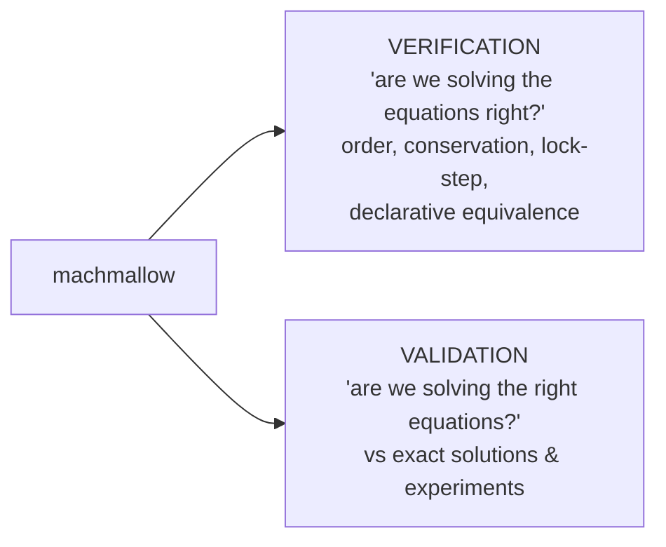

# Verification & Validation (V&V)

The project's discipline: **every functional addition comes with a
quantitative gate** (a driver that returns `PASS`/`FAIL` on a numeric metric),
replayed in CI. This document lists those studies and their results.

We distinguish, in the classical CFD sense:



The numbers below are from the drivers (Apple M4, float32). They may vary by
~1 ULP across machines; the **gates** have margin.

---

## 1. Verification

### 1.1 Order of accuracy

`convergence` (Euler, smooth regime, above the fp32 floor) and `mms`
(Navier–Stokes, manufactured solutions):

| Study | Scheme | Observed order | Expected |
|---|---|---|---|
| Entropy wave (`convergence`) | MUSCL | 1.89 | 2 |
| Entropy wave | WENO5 | 3.72 | 5 (capped by RK3) |
| 2D isentropic vortex | MUSCL / WENO5 | 2.09 / 1.73 | ~2 (1-pt face flux) |
| Sod (discontinuity) | MUSCL / WENO5 | 0.91 / 0.91 | 1 |
| **Viscous MMS** (`mms`) | MUSCL / WENO5 | **2.10 / 1.97** | 2 (central viscous) |
| Viscous MMS + gravity | MUSCL | 2.10 | 2 |
| `sod1d` (regression) | MUSCL | 0.90 | gate > 0.7 |

> The viscous term caps at 2 (central flux, shared by both schemes); WENO's
> high order only shows in grid-aligned smooth flow, and mainly gives a **much
> smaller error constant**. Details: [`NUMERICS.md`](NUMERICS.md).

### 1.2 Conservation

Calibrated on the measured **fp32 rounding floor** (~1e-8/step per active
patch), not on an ideal value; discriminating test = contrast with/without
refluxing.

| Quantity | Study | Drift | Gate |
|---|---|---|---|
| Species mass (200 steps) | `species_suite` g3 | 7.3e-9 | 1e-5 |
| Mass (KH 3 levels, 150 steps) | `mlgpu_amr` g2 | 4.6e-8 | 1e-6 |
| Species mass (Sod AMR) | `mlgpu_amr` g3 | 2.0e-6 | 1e-5 |

### 1.3 CPU ↔ GPU lock-step (near bit-identical)

Each GPU path is compared to its CPU reference. Max relative discrepancy
~1e-4 (fp32 rounding, order of operations):

| Case | Study | Max rel. discrepancy | Gate |
|---|---|---|---|
| DMR 3 levels | `mlgpu_amr` g1 | 1.18e-4 | — |
| Two-gas Sod AMR | `mlgpu_amr` g3 | 1.59e-4 | 1e-2 |
| WENO5 Sod AMR | `mlgpu_amr` g4 | 2.17e-4 | 1e-2 |
| Viscous shear WENO5 | `mlgpu_amr` g5 | 4.38e-4 | 1e-2 |
| Two-gas WENO5 Sod AMR | `mlgpu_amr` g6 | 3.97e-4 | 1e-2 |
| Gravity | `casedef_test` g6 | 3.30e-4 | 1e-3 |
| CJ detonation (speed) | `detonation` | **identical** (4.7168 = 4.7168) | — |
| **Immersed body** (Mach 2 cylinder) | `immersed_gpu` | GPU vs CPU: 2-level single + subcycled + **no-slip**; **3-level** (AmrGpuML vs AmrML) | 5.9e-4 / 1.1e-3 / 4.2e-4 / **7.5e-4** (gate 1e-2) |

### 1.4 Declarative-system equivalence

`casedef_test` locks in that the `.ini` cases reproduce the old C++ presets:

| Gate | Metric | Result | Gate |
|---|---|---|---|
| Sod on AMR (declarative) | L1 | 2.17e-3 | 2.4e-3 |
| DMR ghosts vs preset | differing cells | **0** | 0 |
| KH IC vs analytic | max \|diff\| | 1.9e-9 | 1e-6 |
| Rankine-Hugoniot state (Ms=1.22) | max \|diff\| | 2.0e-7 | 1e-5 |
| Free fall (gravity, 50 steps) | max \|diff\| | 3.3e-7 | 1e-5 |

---

## 2. Validation

### 2.1 Against exact solutions

| Case | Study | Quantity | Result |
|---|---|---|---|
| Sod shock tube | `sod1d` | L1 vs exact Riemann | converges (order 0.90) |
| **Two-gas** Sod (1.4\|1.6) | `species_suite` g2 | L1(ρ) vs two-γ Riemann | 1.2e-3 (gate 6e-3) |
| Two-gas Sod on 3-level AMR | `species_suite` g4 | L1 | 2.6e-3 (gate 5e-3) |
| **Chapman-Jouguet detonation** | `detonation` | speed D vs exact D_CJ (4.6809) | uniform +1.3 %, AMR CPU/GPU +0.8 % |
| **Blasius boundary layer** | `blasius` | profile RMS(u/U − f') | 1.36e-2 (gate 3e-2) |
| | | δ99 vs Blasius | −2.0 % |
| | | Cf vs 0.664/√Re_x | +7.0 % |
| **0D isothermal reactor** | `reactor` g1 | λ vs analytic solution | err 8.4e-8 (gate 1e-5) |
| 0D adiabatic reactor | `reactor` g2 | T vs equilibrium (5.2) | exact (residual 4.8e-7) |
| Stiff reactor (A=1e4, dt=1) | `reactor` g3 | stability | bounded, λ=1 |
| Two-gas interface advection | `species_suite` g1 | pressure oscillation | \|p−1\| < 1.0e-2 (no spurious oscillation) |
| **Shock reflection / immersed wall** | `immersed` | wall p vs exact 1D reflection, Ms=2 (subsonic post-shock) | 14.95 / 15.0 (**0.33 %**); \|u\|/u_i = 0 |
| same, Ms=3 (**supersonic** post-shock toward the wall, M1≈1.36) | `immersed` | wall p vs exact (locks in the supersonic wall flux) | 51.68 / 51.67 (**0.02 %**, gate 5 %) |
| **Declarative** immersed wall (`[solid]`) | `immersed_case` | same via `cases/shock_wall.ini` (parse → `solidAt` → mask) | 14.95 (**0.33 %**, gate 5 %) |
| Immersed wall **+ AMR** (2 levels, boundary + shock refined) | `immersed_amr` | wall p vs exact + consistency vs base grid; single-rate AND subcycled | 14.98 / 15.00 (**0.14 / 0.03 %**); vs base 0.19 % |
| Immersed wall **+ multi-level AMR** (`AmrML`, 3 levels) | `immersed_amr` | wall p vs exact (mask at every level) | 15.03 (**0.21 %**, 16 patches) |
| **Oblique shock on immersed** wedge (M=2.5, θ=15°) | `immersed_wedge` | shock angle β vs exact **θ-β-M** relation | 38.3° vs 36.9° (**1.4°**, staircase bias, gate 2°) |
| Wedge wall pressure (drag integrand) | `immersed_wedge` | wall C_p vs exact oblique-shock p₂ | 2.447 vs 2.468 (**0.8 %**) |
| **Lift** of a symmetric cylinder (∫p) | `immersed_wedge` | F_y vs 0 (exact symmetry) | \|F_y/F_x\| = **0.000** (gate 0.03) |
| **Blasius on immersed plate** (viscous no-slip) | `immersed_noslip` | profile vs f', Cf vs 0.664/√Re_x | RMS **0.7 %**; Cf **3 %** (Re_x≈1600) |

### 2.2 Against experiment

| Case | Study | Quantity | Result |
|---|---|---|---|
| **Helium bubble / shock** (Haas & Sturtevant 1987) | `hs_suite` | upstream interface V | +6.7 % (gate ±10 %) |
| | | downstream interface V | +5.6 % (gate ±10 %) |
| | | air jet V | −0.7 % (gate −10/+15 %) |

### 2.3 Canonical references

| Case | Study | Checks |
|---|---|---|
| Double Mach reflection (Woodward & Colella 1984) | `dmr_amr`, `mlgpu_amr` g1 | structure (triple point, Mach stem, KH slip line), high-Mach stability (M=10), lock-step |
| Kelvin-Helmholtz | `kh_amr` | roll-ups, periodic conservation |
| Isentropic vortex | `convergence` | dissipation (WENO ~6× less than MUSCL) |
| **Mach 3 step** (Woodward & Colella 1984) | `cases/wc_step.ini` | aligned immersed body: detached bow shock, Mach reflection, triple point, slip line, corner rarefaction (stagnation ρ 6.27) |
| **Mach 2 cylinder** | `cases/cylinder_bowshock.ini` | staircased curved body: detached bow shock, shoulder rarefaction, wake (stagnation ρ 4.36) |

---

## 3. Running the studies

```sh
cmake --build build -j
# CPU verification / validation (fast)
./build/sod1d ; ./build/convergence ; ./build/mms ; ./build/reactor
./build/immersed ; ./build/immersed_case ; ./build/immersed_amr
./build/immersed_wedge ; ./build/immersed_noslip
./build/species_suite ; ./build/casedef_test ; ./build/weno_suite
# GPU validation
./build/mlgpu_amr ; ./build/dmr_amr 32 gpu ; ./build/detonation
./build/hs_suite ; ./build/blasius
```

Each executable returns `0` (PASS) or `1` (FAIL) and prints its metrics.

**CI** (`.github/workflows/ci.yml`) replays everything on every push:
- **CPU suite** (GPU-less machine): sod*, convergence, **mms**,
  **immersed**, **immersed_case**, **immersed_amr**, **immersed_wedge**,
  **immersed_noslip**, reactor, species_suite, weno_suite, analytic_suite,
  casedef_test, + `--check` of all `cases/*.ini`;
- **GPU suite** (Metal runner): dmr_gpu, dmr_amr, **mlgpu_amr**,
  **immersed_gpu**, detonation, hs_suite, blasius.

**Heavy manual studies** (compiled in CI, not executed): `benchmark` (GPU vs
CPU throughput) and `deflagration` (diffusive laminar flame, dt ~ dx²/ν).

---

## 4. Methodology & limits

- **Order measured in a smooth regime AND on the right grid regime**: TVD
  limiters cap at ~1 at smooth extrema, the midpoint face flux caps multi-D
  near 2, and the **fp32 floor** caps everything at large N (the order is read
  *before* the floor).
- **Conservation gates** calibrated on the measured fp32 rounding floor, not
  on an ideal value.
- **Lock-step**: we do not require strict bit-for-bit equality but a ~1e-4
  discrepancy (fp32 re-association of GPU sums); the detonation, however,
  comes out identical.
- **Apple Silicon benchmarks**: ±30 % variance on small cases (GPU frequency
  governor) → best-of-N, and large cases are more reliable.
- The **physical validation** discrepancies (Blasius Cf +7 %, H&S bubble
  ±7 %) reflect finite resolution and regime (moderate Re_x) — they are
  *quantified and gated*, not hidden.

---

*See [`NUMERICS.md`](NUMERICS.md) for the schemes, [`ROADMAP.md`](../ROADMAP.md)
for the milestone history and design lessons.*
