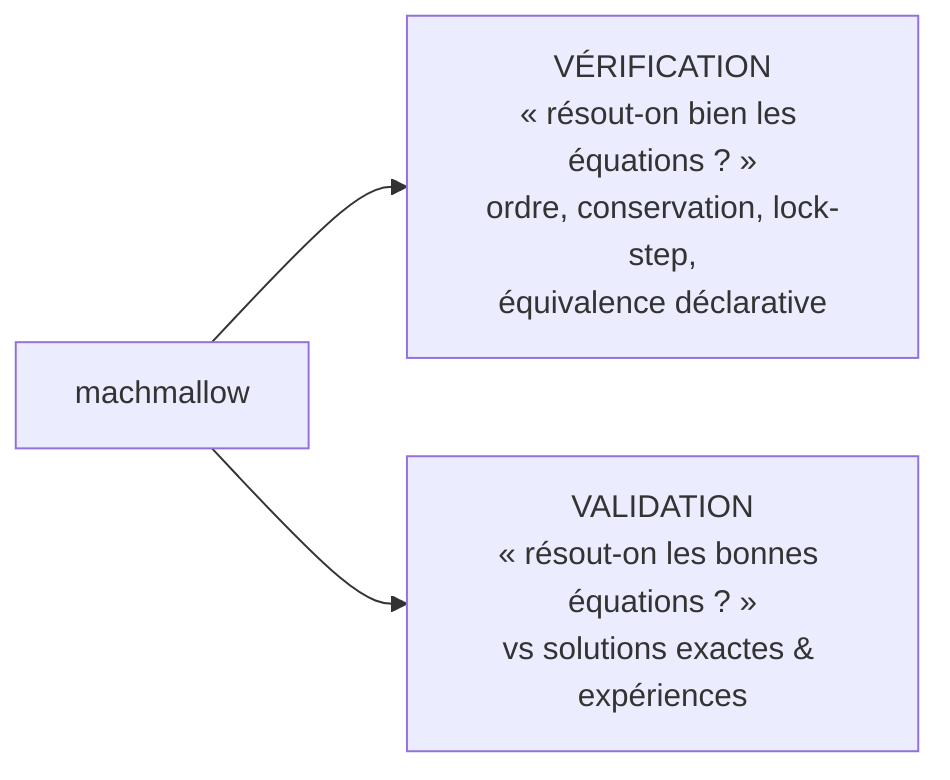

# Vérification & Validation (V&V)

La discipline du projet : **toute addition fonctionnelle vient avec une
porte quantitative** (un driver qui renvoie `PASS`/`FAIL` sur une métrique
chiffrée), rejouée en CI. Ce document recense ces études et leurs résultats.

On distingue, au sens classique de la CFD :



Les chiffres ci-dessous sont ceux des drivers (Apple M4, float32). Ils
peuvent varier de ~1 ULP selon la machine ; les **portes** ont une marge.

---

## 1. Vérification

### 1.1 Ordre de précision

`convergence` (Euler, régime lisse, hors plancher fp32) et `mms` (Navier-
Stokes, solutions manufacturées) :

| Étude | Schéma | Ordre observé | Attendu |
|---|---|---|---|
| Onde d'entropie (`convergence`) | MUSCL | 1.89 | 2 |
| Onde d'entropie | WENO5 | 3.72 | 5 (plafonné par RK3) |
| Vortex isentropique 2D | MUSCL / WENO5 | 2.09 / 1.73 | ~2 (flux de face 1 pt) |
| Sod (discontinuité) | MUSCL / WENO5 | 0.91 / 0.91 | 1 |
| **MMS visqueux** (`mms`) | MUSCL / WENO5 | **2.10 / 1.97** | 2 (visqueux central) |
| MMS visqueux + gravité | MUSCL | 2.10 | 2 |
| `sod1d` (régression) | MUSCL | 0.90 | gate > 0.7 |

> Le visqueux plafonne à 2 (flux central commun aux deux schémas) ;
> l'ordre élevé de WENO ne se voit qu'en lisse aligné, et donne surtout une
> **constante d'erreur bien plus petite**. Détails : [`NUMERICS.md`](NUMERICS.md).

### 1.2 Conservation

Calibrée sur le **plancher d'arrondi fp32** mesuré (~1e-8/pas par patch
actif), pas sur une valeur idéale ; test discriminant = contraste
avec/sans refluxing.

| Quantité | Étude | Dérive | Gate |
|---|---|---|---|
| Masse d'espèce (200 pas) | `species_suite` g3 | 7.3e-9 | 1e-5 |
| Masse (KH 3 niveaux, 150 pas) | `mlgpu_amr` g2 | 4.6e-8 | 1e-6 |
| Masse d'espèce (Sod AMR) | `mlgpu_amr` g3 | 2.0e-6 | 1e-5 |

### 1.3 Lock-step CPU ↔ GPU (bit-quasi-identique)

Chaque chemin GPU est comparé à sa référence CPU. Écart relatif max ~1e-4
(arrondi fp32, ordre des opérations) :

| Cas | Étude | Écart rel. max | Gate |
|---|---|---|---|
| DMR 3 niveaux | `mlgpu_amr` g1 | 1.18e-4 | — |
| Sod bi-gaz AMR | `mlgpu_amr` g3 | 1.59e-4 | 1e-2 |
| WENO5 Sod AMR | `mlgpu_amr` g4 | 2.17e-4 | 1e-2 |
| Cisaillement visqueux WENO5 | `mlgpu_amr` g5 | 4.38e-4 | 1e-2 |
| Sod bi-gaz WENO5 AMR | `mlgpu_amr` g6 | 3.97e-4 | 1e-2 |
| Gravité | `casedef_test` g6 | 3.30e-4 | 1e-3 |
| Détonation CJ (vitesse) | `detonation` | **identique** (4.7168 = 4.7168) | — |
| **Corps immergé** (cylindre Mach 2, 2 niv.) | `immersed_gpu` | AmrGpu vs Amr2, single + subcyclé | 5.9e-4 / 1.1e-3 (gate 1e-2) |

### 1.4 Équivalence du système déclaratif

`casedef_test` verrouille que les cas `.ini` reproduisent les anciens
presets C++ :

| Gate | Métrique | Résultat | Gate |
|---|---|---|---|
| Sod sur AMR (déclaratif) | L1 | 2.17e-3 | 2.4e-3 |
| Ghosts DMR vs preset | cellules différentes | **0** | 0 |
| IC KH vs analytique | max \|diff\| | 1.9e-9 | 1e-6 |
| État Rankine-Hugoniot (Ms=1.22) | max \|diff\| | 2.0e-7 | 1e-5 |
| Chute libre (gravité, 50 pas) | max \|diff\| | 3.3e-7 | 1e-5 |

---

## 2. Validation

### 2.1 Contre solutions exactes

| Cas | Étude | Quantité | Résultat |
|---|---|---|---|
| Tube à choc de Sod | `sod1d` | L1 vs Riemann exact | converge (ordre 0.90) |
| Sod **bi-gaz** (1.4\|1.6) | `species_suite` g2 | L1(ρ) vs Riemann bi-γ | 1.2e-3 (gate 6e-3) |
| Sod bi-gaz sur AMR 3 niv. | `species_suite` g4 | L1 | 2.6e-3 (gate 5e-3) |
| **Détonation Chapman-Jouguet** | `detonation` | vitesse D vs D_CJ exact (4.6809) | uniforme +1.3 %, AMR CPU/GPU +0.8 % |
| **Couche limite de Blasius** | `blasius` | profil RMS(u/U − f') | 1.36e-2 (gate 3e-2) |
| | | δ99 vs Blasius | −2.0 % |
| | | Cf vs 0.664/√Re_x | +7.0 % |
| **Réacteur 0D isotherme** | `reactor` g1 | λ vs solution analytique | err 8.4e-8 (gate 1e-5) |
| Réacteur 0D adiabatique | `reactor` g2 | T vs équilibre (5.2) | exact (résidu 4.8e-7) |
| Réacteur raide (A=1e4, dt=1) | `reactor` g3 | stabilité | borné, λ=1 |
| Advection d'interface bi-gaz | `species_suite` g1 | oscillation de pression | \|p−1\| < 1.0e-2 (pas d'oscillation parasite) |
| **Réflexion de choc / paroi immergée** | `immersed` | p paroi vs réflexion 1D exacte, Ms=2 (post-choc subsonique) | 14.95 / 15.0 (**0.33 %**) ; \|u\|/u_i = 0 |
| idem, Ms=3 (post-choc **supersonique** vers la paroi, M1≈1.36) | `immersed` | p paroi vs exact (verrouille le flux de paroi supersonique) | 51.68 / 51.67 (**0.02 %**, gate 5 %) |
| Paroi immergée **déclarative** (`[solid]`) | `immersed_case` | idem via `cases/shock_wall.ini` (parsing → `solidAt` → masque) | 14.95 (**0.33 %**, gate 5 %) |
| Paroi immergée **+ AMR** (2 niv., bord + choc raffinés) | `immersed_amr` | p paroi vs exact + cohérence vs grille de base ; single-rate ET subcyclé | 14.98 / 15.00 (**0.14 / 0.03 %**) ; vs base 0.19 % |
| **Choc oblique sur dièdre** immergé (M=2.5, θ=15°) | `immersed_wedge` | angle de choc β vs relation exacte **θ-β-M** | 38.3° vs 36.9° (**1.4°**, biais d'escalier, gate 2°) |
| Pression de paroi du dièdre (intégrande de traînée) | `immersed_wedge` | C_p paroi vs choc oblique exact p₂ | 2.447 vs 2.468 (**0.8 %**) |
| **Portance** d'un cylindre symétrique (∫p) | `immersed_wedge` | F_y vs 0 (symétrie exacte) | \|F_y/F_x\| = **0.000** (gate 0.03) |

### 2.2 Contre l'expérience

| Cas | Étude | Quantité | Résultat |
|---|---|---|---|
| **Bulle d'hélium / choc** (Haas & Sturtevant 1987) | `hs_suite` | V interface amont | +6.7 % (gate ±10 %) |
| | | V interface aval | +5.6 % (gate ±10 %) |
| | | V jet d'air | −0.7 % (gate −10/+15 %) |

### 2.3 Référence canonique

| Cas | Étude | Vérifie |
|---|---|---|
| Double Mach reflection (Woodward & Colella 1984) | `dmr_amr`, `mlgpu_amr` g1 | structure (point triple, tige de Mach, glissement KH), stabilité fort Mach (M=10), lock-step |
| Kelvin-Helmholtz | `kh_amr` | enroulements, conservation périodique |
| Vortex isentropique | `convergence` | dissipation (WENO ~6× moins que MUSCL) |
| **Marche Mach 3** (Woodward & Colella 1984) | `cases/wc_step.ini` | corps immergé aligné : arc détaché, réflexion de Mach, point triple, glissement, détente de coin (ρ stagnation 6.27) |
| **Cylindre Mach 2** | `cases/cylinder_bowshock.ini` | corps courbe en escalier : arc de choc détaché, détente aux épaules, sillage (ρ stagnation 4.36) |

---

## 3. Lancer les études

```sh
cmake --build build -j
# vérification / validation CPU (rapide)
./build/sod1d ; ./build/convergence ; ./build/mms ; ./build/reactor
./build/immersed ; ./build/immersed_case ; ./build/immersed_amr
./build/immersed_wedge
./build/species_suite ; ./build/casedef_test ; ./build/weno_suite
# validation GPU
./build/mlgpu_amr ; ./build/dmr_amr 32 gpu ; ./build/detonation
./build/hs_suite ; ./build/blasius
```

Chaque exécutable renvoie `0` (PASS) ou `1` (FAIL) et imprime ses métriques.

La **CI** (`.github/workflows/ci.yml`) rejoue tout à chaque push :
- **suite CPU** (machine sans GPU) : sod*, convergence, **mms**,
  **immersed**, **immersed_case**, **immersed_amr**, **immersed_wedge**,
  reactor, species_suite, weno_suite, analytic_suite, casedef_test, +
  `--check` de tous les cas `cases/*.ini` ;
- **suite GPU** (runner Metal) : dmr_gpu, dmr_amr, **mlgpu_amr**,
  **immersed_gpu**, detonation, hs_suite, blasius.

Études **lourdes manuelles** (compilées en CI, pas exécutées) : `benchmark`
(débit GPU vs CPU) et `deflagration` (flamme laminaire diffusive, dt ~ dx²/ν).

---

## 4. Méthodologie & limites

- **Ordre mesuré en régime lisse ET sur le bon régime de grilles** : les
  limiteurs TVD plafonnent à ~1 aux extrema lisses, le flux de face au
  point milieu plafonne le multi-D près de 2, et le **plancher fp32**
  plafonne tout aux grandes N (l'ordre se lit *avant* le plancher).
- **Portes de conservation** calibrées sur le plancher d'arrondi fp32
  mesuré, pas une valeur idéale.
- **Lock-step** : on n'exige pas l'égalité bit-à-bit stricte mais un écart
  ~1e-4 (réassociation des sommes GPU en fp32) ; la détonation, elle,
  ressort identique.
- **Benchmarks Apple Silicon** : variance ±30 % sur les petits cas
  (gouverneur de fréquence GPU) → best-of-N, et les gros cas sont plus
  fiables.
- Les écarts de **validation physique** (Blasius Cf +7 %, bulle H&S ±7 %)
  reflètent la résolution finie et le régime (Re_x modéré) — ils sont
  *quantifiés et gatés*, pas masqués.

---

*Voir [`NUMERICS.md`](NUMERICS.md) pour les schémas, [`ROADMAP.md`](../ROADMAP.md)
pour l'historique des jalons et les leçons de conception.*
