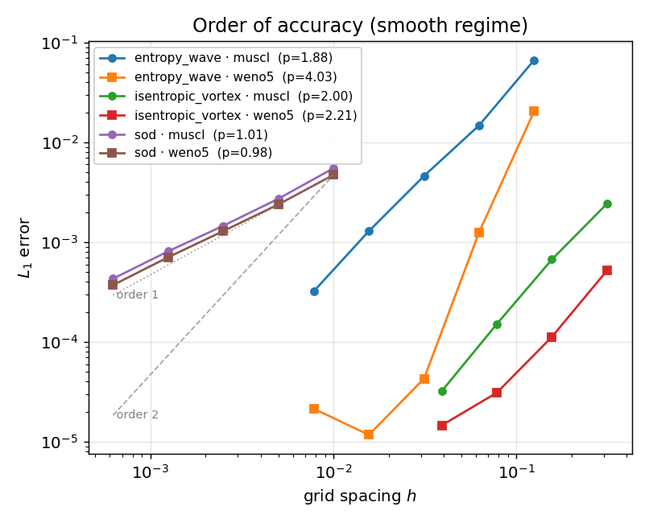
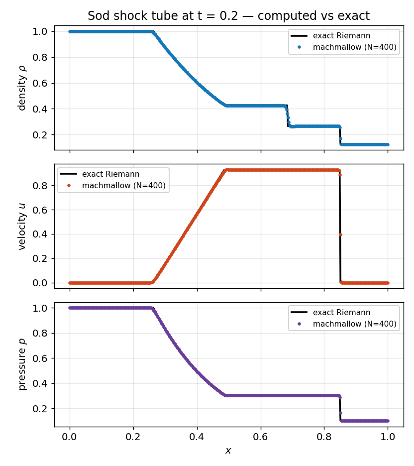
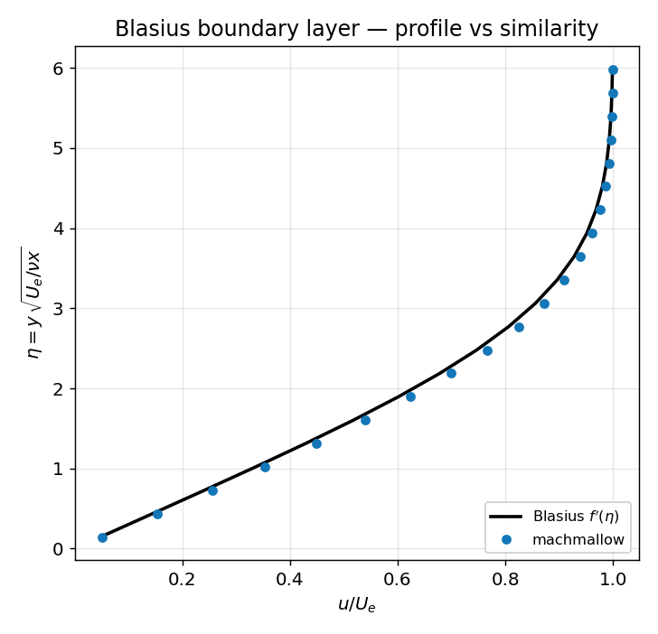
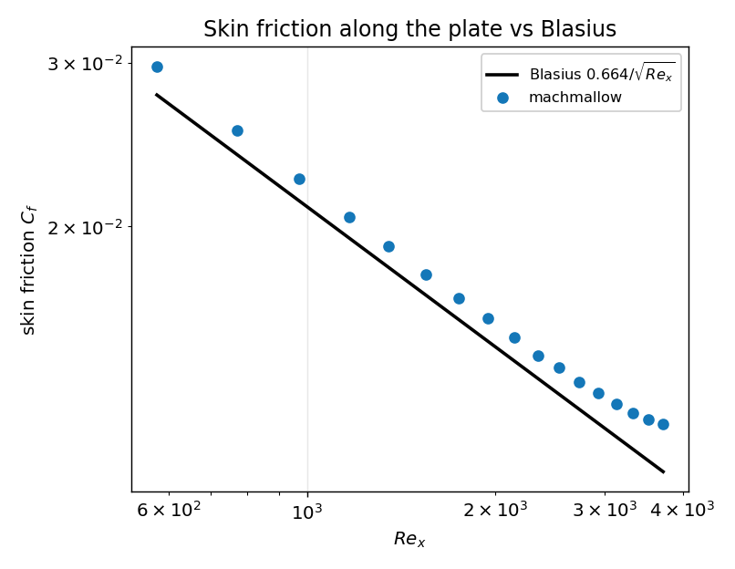

# Verification & Validation — figures

Reproducible evidence that machmallow solves the equations right
(**verification**) and the right equations (**validation**). Every figure
below is generated from a driver's output by `vv/generate.py` and committed,
so it renders here without running anything.

> These are the highlights with pictures. The **full gate list** (20+
> quantitative PASS/FAIL gates, replayed in CI) is in
> [`docs/VALIDATION.md`](../docs/VALIDATION.md).

Regenerate everything:

```sh
cmake --build build -j
python3 vv/generate.py
```

Numbers below are from an Apple M4 (float32); they may vary by ~1 ULP across
machines. All studies **PASS** their CI gates.

---

## 1. Verification — order of accuracy

Smooth-regime convergence: the $L_1$ error must fall at the scheme's design
rate as the grid is refined (measured before the float32 roundoff floor
flattens the curve).

> **Numerical setup** — MUSCL-Hancock + HLLC **and** WENO5 + SSP-RK3, on
> **uniform grids** (no AMR), inviscid Euler, CFL 0.4. Problems: entropy wave
> (periodic, t=1), 2D isentropic vortex (10×10 periodic, t=2), Sod (t=0.2).
> Exact reference = the advected initial condition (smooth cases) / the exact
> Riemann solution (Sod). float32.



| Problem | Scheme | Observed order |
|---|---|---|
| entropy wave | MUSCL | 1.88 |
| entropy wave | WENO5 | 4.03 |
| isentropic vortex | MUSCL | 2.00 |
| isentropic vortex | WENO5 | 2.21 |

MUSCL converges at ~2; WENO5's formal order 5 is capped by the RK3 time
integration and the midpoint face flux, but it carries a **much smaller error
constant** (the vortex is ~6× less dissipated than MUSCL at equal
resolution). The viscous Navier–Stokes operator is separately verified at
order 2 by manufactured solutions (`mms`; see `docs/VALIDATION.md`).

---

## 2. Validation — Sod shock tube vs exact Riemann

The classic Riemann problem: density, velocity and pressure at t = 0.2
overlaid on the exact solution. The scheme captures the rarefaction, the
contact discontinuity and the shock without spurious oscillations.

> **Numerical setup** — MUSCL-Hancock + HLLC, **1D uniform grid** (no AMR),
> inviscid Euler, CFL 0.8, t = 0.2. Grid-convergence study N = 100 → 1600;
> profile shown at N = 400. Reference = exact Riemann solution. float32.



Grid-convergence order (L1 density vs the exact solution): **0.90**
(≈1, as expected for a discontinuous solution). Profile shown at N = 400.

---

## 3. Validation — Blasius boundary layer vs similarity

A low-Mach viscous flow over a flat plate. At the measurement station
(Re_x = 2732) the steady velocity profile must collapse onto the Blasius
similarity solution $u/U_e = f'(\eta)$.

> **Numerical setup** — MUSCL-Hancock + HLLC, **single uniform grid 320×256**
> (dx = dy ≈ 3.9e-3, **no AMR**), GPU (`hybrid` backend), Navier–Stokes
> μ = 8e-5, CFL 0.4, free stream U = 0.3 (**M ≈ 0.25**). BCs: inflow (left),
> zero-gradient (right), **pinned free stream** on top (zero pressure
> gradient), and an **aligned bottom wall** — slip ahead of the leading edge
> (x < 0.15), **no-slip** on the plate. Marched to steady state. float32.



The skin friction measured at several stations along the plate, against the
Blasius law $C_f = 0.664/\sqrt{Re_x}$:



| Quantity (station Re_x = 2732) | Result vs theory |
|---|---|
| profile RMS $(u/U_e - f')$ | 1.3618e-02 (gate 3e-2) |
| boundary-layer thickness $\delta_{99}$ | -2.0% |
| skin friction $C_f$ vs $0.664/\sqrt{Re_x}$ | 7.0% |

**Explaining the small discrepancies** (they are quantified and gated, not
hidden). The $C_f$ figure shows a positive bias everywhere, with a **minimum
(~+5 %) near mid-plate** growing toward both ends — each part has a cause:
- **~+5 % floor (mid-plate)** — the wall shear is estimated with a
  **first-order one-sided difference** over the first half-cell,
  $du/dy \approx u_1/(dy/2)$. On a finite grid this **overestimates** the true
  wall gradient of a curved profile, a roughly constant bias that shrinks as
  the wall is refined (higher $N_y$). The profile RMS (1.4 %) is the cleaner,
  less discretization-sensitive metric.
- **rise toward the outflow** (up to +12 % at x→1.1) — the transmissive right
  boundary and finite domain distort the near-exit edge velocity and profile;
  it is a boundary artifact, not a scheme error (a longer domain / a
  non-reflecting outflow would remove it).
- **rise toward the leading edge** — there the boundary layer is thinnest
  (fewest cells across it) and the slip→no-slip transition + LE singularity
  sit right there, so the same wall-gradient bias is larger.
- **δ99 (≈ −2 %)** — read as the first cell reaching 0.99 $U_e$ on a discrete
  grid; that threshold-crossing is resolution-limited (the true point sits
  between two cells).
- **compressibility & non-parallel effects** — the run is at **M ≈ 0.25**
  (Blasius is incompressible) at a **moderate** Re_x (Blasius is the Re → ∞,
  δ ≪ x asymptotic limit). The pinned-top ZPG keeps the free-stream drift
  small (Ue/U0 ≈ 1.04), which the comparison divides out via the local edge
  velocity $U_e$.

The reported station (Re_x = 2732, +7 %) sits on the rising branch toward the
outflow; the mid-plate agreement is closer (~+5 %). All metrics pass their
gates and shrink with resolution / lower Mach / a non-reflecting outflow.

---

*Generated by [`vv/generate.py`](generate.py). Source data in
[`vv/data/`](data/). Full V&V gate list: [`docs/VALIDATION.md`](../docs/VALIDATION.md).*
