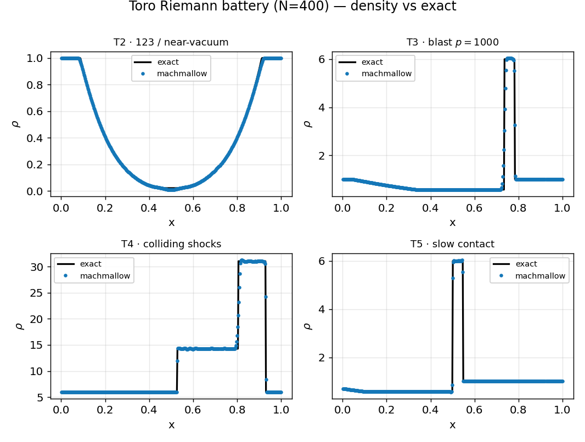
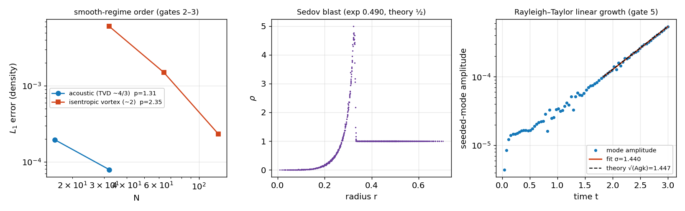

# Analytic suite — *verification & validation*

**Objective.** Exercise the solver against exact/theoretical references the
single Sod case cannot: (1) **Toro's Riemann battery** (tests 2–5) — the hard
1D problems: near-vacuum double rarefaction, a p = 1000 blast, colliding strong
shocks, a slowly-moving contact — vs the exact Riemann solver; (2) a smooth
**acoustic wave** returning onto its IC after one period (smooth-regime order);
(3) the **isentropic vortex** (Yee) advected one period (canonical smooth 2D
Euler); (4) **Sedov** self-similar blast exponent ($r\sim t^{1/2}$); (5)
**Rayleigh–Taylor** linear growth rate vs $\sqrt{Agk}$.

## Numerical setup
> MUSCL-Hancock + HLLC, CFL 0.4, uniform grids. Riemann battery: N = 400,
> transmissive, reduced start-up CFL for the sharp IC. Acoustic/vortex:
> periodic, order from grid refinement. Sedov: 256², point energy in 3 cells.
> RT: seeded single mode, growth from a least-squares fit of $\ln a(t)$.
> Driver: `analytic_suite`. float32.

## Results
**Gate 1 — Toro battery** (density vs the exact Riemann solution):

**Gates 2–5 — smooth order, Sedov blast, Rayleigh–Taylor growth:**

| Gate | Test | What the panel shows | Result |
|---|---|---|---|
| 1 | Toro T2–T5 | 4 hard Riemann problems on the exact solution | L1 3.7171e-03 / 3.4866e-02 / 1.2314e-01 / 4.4213e-03 |
| 2 | acoustic wave order | left panel, cyan — L1 vs N | 1.31 (TVD-extremum theory 4/3) |
| 3 | isentropic vortex order | left panel, ember — L1 vs N | 2.35 (gate > 1.5) |
| 4 | Sedov 2D blast | middle panel — radial density collapse | exponent 0.490 (theory ½, ±0.03) |
| 5 | Rayleigh–Taylor growth | right panel — mode amplitude vs time | σ 1.440 vs √(Agk) 1.447 (±15 %) |

## Discussion
The four Toro tests are the standard robustness gauntlet: the solver survives
the **near-vacuum** double rarefaction (positivity), the **p = 1000 blast** and
the **colliding-shock** problem (strong-shock stability), and resolves the
**slowly-moving contact** — all within their exact-solution error gates and
with no NaNs. The acoustic order sits at the TVD **4/3** ceiling (limiters clip
the smooth sine crests — the documented motivation for WENO5, see
[the WENO suite](weno.md)), while the vortex — error-dominated away from
extrema — reaches ~2. Sedov recovers the self-similar **½** exponent and RT
matches the linear dispersion relation $\sqrt{Agk}$ to within a few percent.
Together these pin the scheme's accuracy **and** its nonlinear robustness.

---
*Part of the [V&V dossier](../README.md). Regenerate: `python3 vv/generate.py`. Source data: [`../data/`](../data/).*
