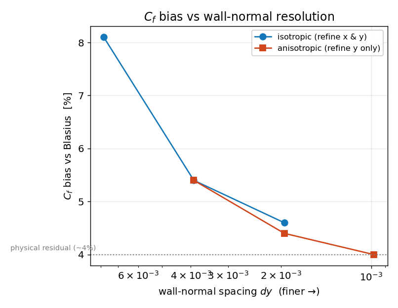

# Blasius boundary layer — *validation vs similarity*

**Objective.** A low-Mach viscous flow over a flat plate: at the measurement
station (Re_x = 2732) the steady velocity profile must collapse onto the
Blasius similarity solution $u/U_e = f'(\eta)$, with the right boundary-layer
thickness and skin friction.

## Numerical setup
> **MUSCL-Hancock and WENO5**, both with HLLC, on a **single uniform grid
> 320×256** (dx = dy ≈ 3.9e-3, **no AMR**), GPU (`hybrid` backend),
> Navier–Stokes μ = 8e-5, CFL 0.4, free stream U = 0.3 (**M ≈ 0.25**). BCs:
> inflow (left), zero-gradient (right), **pinned free stream** on top (ZPG),
> and an **aligned bottom wall** — slip ahead of the leading edge (x < 0.15),
> **no-slip** on the plate. Marched to steady state. float32. Driver:
> `blasius`.

## Results

### Velocity profile

MUSCL and WENO5 land essentially on top of each other — expected for a
**smooth steady** boundary layer (shared viscous operator, no discontinuities
to sharpen); a useful cross-scheme consistency check. Gated metrics are from
the MUSCL run:

| Quantity (station Re_x = 2732) | Result vs theory |
|---|---|
| profile RMS $(u/U_e - f')$ | 1.3618e-02 (gate 3e-2) |
| boundary-layer thickness $\delta_{99}$ | -2.0% |
| skin friction $C_f$ vs $0.664/\sqrt{Re_x}$ | 7.0% |

### Skin friction along the plate

## Discussion — where the Cf bias comes from
The Cf is biased high everywhere (~+5 % mid-plate, +7 % at the leading edge,
+12 % near the outflow). A grid-convergence + Mach study (reproduce with
`bash vv/blasius_study.sh`) pins down each cause:

- **Dominant — near-wall resolution.** Refining the wall-normal grid drives
  the mid-plate bias down monotonically (+8.1 % at ny=128 → +4.0 % at
  ny=1024). The estimator is *exact* for a Blasius profile (near-wall velocity
  linear to $O(\eta^4)$), so this is the finite-grid wall shear, not the
  formula. **Refining in y *alone* recovers the accuracy at ~half the cells**
  of isotropic refinement — the error is purely wall-normal.
- **Compressibility — ruled out.** At fixed Re_x and resolution, lowering the
  Mach number from 0.25 to 0.06 leaves the bias unchanged (+5.4 → +5.5 %).
- **Residual ~+4 %** — consistent with the weak **favorable pressure
  gradient** ($U_e$ drifts +2 % under the pinned top); Mach- and
  grid-independent. (Virtual-origin shift ruled out — mid-plate already flat.)
- **Local rises** — leading edge (thinnest BL, fewest cells + LE singularity);
  outflow (transmissive-boundary artifact). δ99 (−2 %) is the discrete
  0.99-crossing.

**Design note.** Industrial codes avoid this bias with wall-normal
*stretching* (body-fitted prism layers, y⁺ < 1) — not possible on our
uniform-Cartesian + ratio-2 block-AMR foundation. The on-design equivalent is
the anisotropic uniform grid above. All metrics pass their gates.

---
*Part of the [V&V dossier](../README.md). Regenerate: `python3 vv/generate.py`. Source data: [`../data/`](../data/).*
