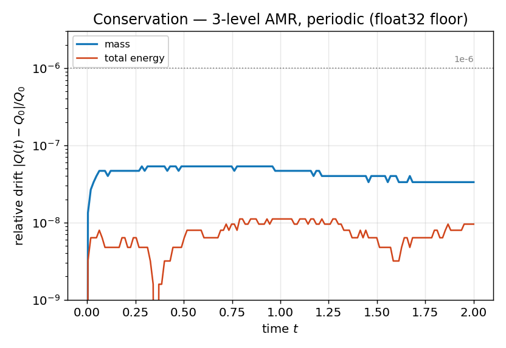

# Conservation — *verification*

**Objective.** On a fully **periodic** domain the total mass and total energy
are exactly conserved by the continuous equations; the discrete solver must
hold them to the float32 rounding floor — in particular the Berger–Colella
**refluxing** must cancel the coarse/fine flux mismatch at AMR interfaces.

## Numerical setup
> Periodic viscous Kelvin–Helmholtz (μ = 2e-4), MUSCL-Hancock + HLLC, **3-level
> subcycled AMR**, CFL 0.4, t = 2.0, GPU (`hybrid`). Mass and total energy
> logged every 10 base steps. Case: [`vv/conservation.ini`](../conservation.ini).

## Results

## Discussion
Both invariants stay at the **float32 rounding floor** (~1e-7 relative over the
whole run, ≈1e-8 per step per active patch) — orders of magnitude below any
physical scale, and flat in time (no secular leak). This is the discriminating
test for the refluxing: without it, the coarse/fine flux mismatch would show
as a steadily growing mass drift. Tolerances elsewhere are calibrated on this
measured floor, not on an idealized zero.

---
*Part of the [V&V dossier](../README.md). Regenerate: `python3 vv/generate.py`. Source data: [`../data/`](../data/).*
