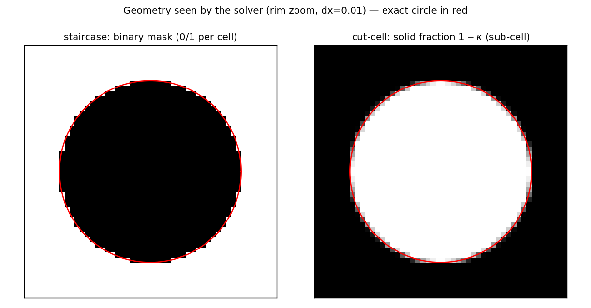
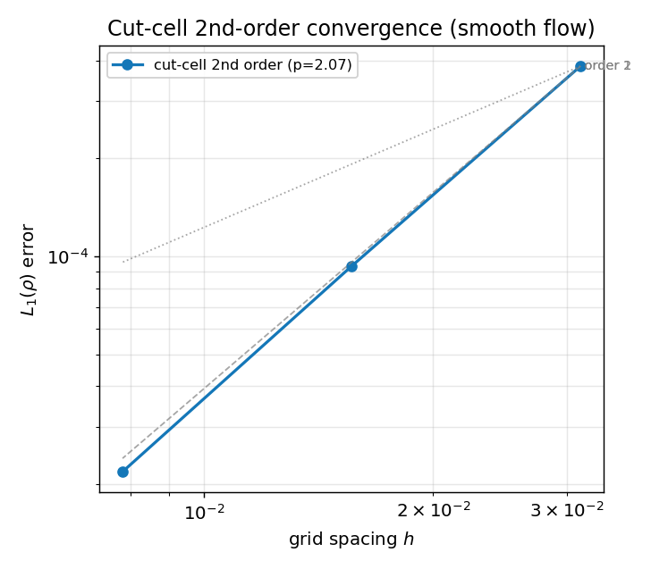
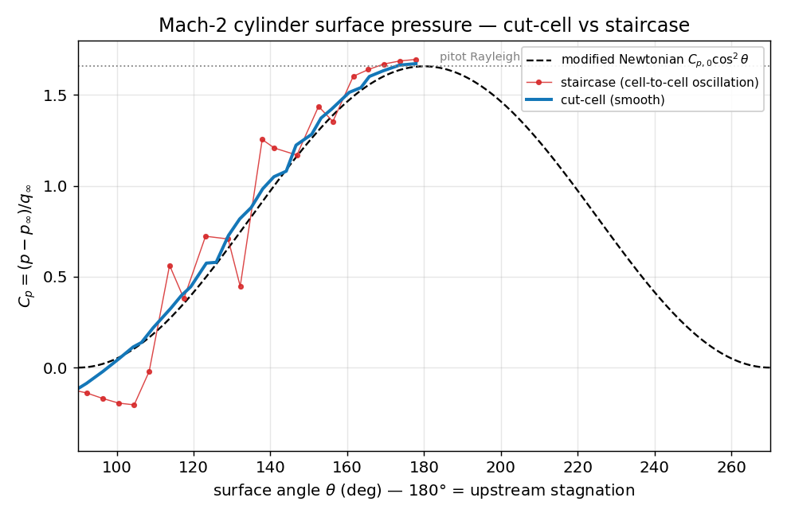

# Cut cells (embedded boundary) — *verification & validation*

**Objective.** Validate the **cut-cell** treatment of immersed bodies — the
geometrically exact alternative to the staircase mask (aperture-weighted fluxes
+ flux redistribution + slip/no-slip embedded-boundary flux) — across five
fronts: (1) the **geometry** is exact (fluid area, EB normal); (2) the scheme is
**2nd order** on a smooth flow; (3) the **surface pressure** on a Mach-2 cylinder
matches the exact stagnation value and is *smooth* where the staircase
oscillates; (4) a **no-slip** boundary layer (Couette) matches the exact
profile; (5) the operator is **conservative through the AMR** and matches the
GPU in lock-step, at any depth.

## Numerical setup
> Aperture-weighted HLLC faces + exact slip-wall EB flux, 2nd order = LSQ
> gradients (Barth–Jespersen) + SSP-RK2; hybrid flux redistribution for the
> small-cell problem. Full cells reduce to 2nd-order MUSCL-HLLC; only cut cells
> get the aperture / EB / FRD treatment. Threaded through the AMR (Amr2/AmrML)
> and ported to Metal (AmrGpuCut/AmrGpuMLCut). Drivers: `cutcell_geom`,
> `cutcell_o2`, `cutcell_cp`, `cutcell_viscous`, `cutcell_amr_ml`,
> `cutcell_gpu_ml`. float32.

## Results

**Geometry — exact vs staircase.** The fluid fraction κ the solver actually
uses (sub-cell) hugs the true circle, where the staircase mask steps in and out
of it by up to a full cell:

**2nd-order convergence** on a smooth flow (entropy blob grazing a 45° wall):

**Surface pressure** on the Mach-2 cylinder — cut-cell smooth (tracks the
modified-Newtonian trend to the pitot value), staircase oscillates cell-to-cell:

| Gate | Test | Result |
|---|---|---|
| geometry | fluid area vs analytic; EB-normal ⟂ interface | area exact (≤1e-9); normal alignment 0.99979 (gate >0.99) |
| order | smooth entropy blob on a 45° wall, L1 order | 2.10 (gate >1.7) |
| surface p | stagnation Cp vs **Rayleigh pitot** (normal shock) | err 0.88 % (gate 3 %) |
| surface p | windward Cp(θ) smoothness vs staircase | **7.3× smoother** (gate 3×) |
| no-slip | Couette profile vs exact linear; order | err ≤ 2.7856e-03/U at 96², order 1.44 |
| conservation | composite mass, 3-level subcycled AMR | drift 4.130e-09 (fp32 floor) |
| GPU | AmrGpuMLCut vs AmrML, 3-level lock-step | ρ 3.397e-06 |

## Discussion
The foundation is the **geometry**: the analytic moments give the fluid area to
the rounding floor and an EB normal aligned with the true interface to
0.99979 — so the boundary is exact at every resolution, not
approximated by cells. On that geometry the scheme reaches **order
2.10** on a smooth flow (LSQ + RK2), and the payoff is
clearest on the **Mach-2 cylinder**: the stagnation pressure matches the exact
Rayleigh-pitot value to 0.88 %, and the windward surface
Cp(θ) is **7.3× smoother** than the staircase, which
oscillates cell-to-cell (see figure — cut tracks the modified-Newtonian trend,
staircase rattles around it). The **no-slip** embedded boundary reproduces the
exact linear Couette profile, and the whole operator stays **conservative
through the AMR** (mass at the fp32 floor across a 3-level subcycled hierarchy
with the body straddling the coarse-fine seams) while the **Metal** port matches
the CPU oracle in lock-step. Together: exact geometry, 2nd order, clean surface
loads, viscous-capable, conservative, and GPU-accelerated at any depth — the
staircase's jaggedness (and its spurious surface noise) removed. Contrast the
[immersed staircase](immersed.md) fiche, which validates the mask approach the
cut cells supersede.

> The rendered body can be drawn at its exact (κ-aware, anti-aliased) boundary
> with `schlieren_video.py --solid-case CASE.ini`.

---
*Part of the [V&V dossier](../README.md). Regenerate: `python3 vv/generate.py`. Source data: [`../data/`](../data/).*
