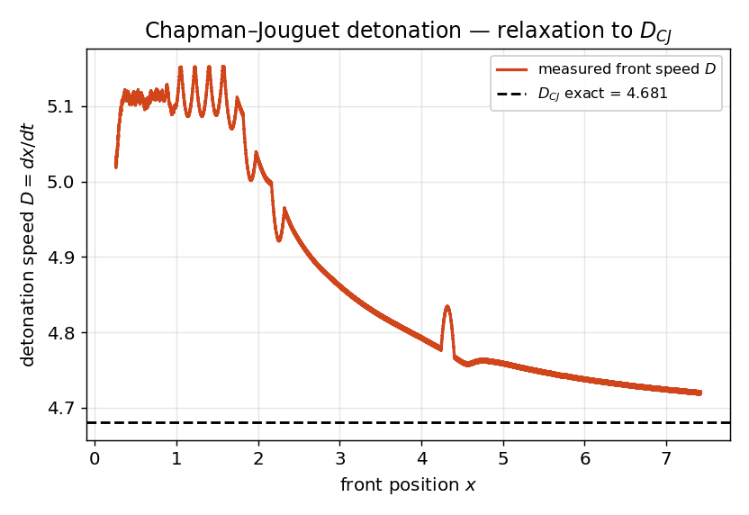

# Chapman–Jouguet detonation — *validation vs exact $D_{CJ}$*

**Objective.** A 1D reactive-Euler detonation in a closed tube: once the
overdriven ignition relaxes (via the Taylor rarefaction), the leading shock
must settle at the exact **Chapman–Jouguet speed** $D_{CJ}$.

## Numerical setup
> Reactive Euler — single-step Arrhenius reaction (q = 10) + heat release,
> MUSCL-Hancock + HLLC, **Strang split** $R(\tfrac{dt}{2})\,\mathcal{H}(dt)\,R(\tfrac{dt}{2})$,
> CFL 0.4, **closed tube** (reflecting walls, hot ignition). Run **uniform**
> and on a **3-level AMR** hierarchy (CPU *and* GPU, refining the reaction
> zone). $D_{CJ}$ solved exactly from Rankine–Hugoniot + the CJ tangency
> condition. Driver: `detonation`.

## Results

| Speed | Value | vs $D_{CJ}$ |
|---|---|---|
| $D_{CJ}$ exact | 4.6809 | — |
| uniform | 4.7426 | 1.3 % (gate 3 %) |
| 3-level AMR (CPU) | 4.7168 | 0.8 % (gate 5 %) |
| 3-level AMR (GPU) | 4.7168 | 0.8 % (lock-step) |

## Discussion
The overdriven ignition decays toward $D_{CJ}$ through the Taylor
rarefaction — the measured front speed relaxes onto the dashed line. AMR
refines the reaction zone and *tightens* the agreement (+0.8 % vs +1.3 %
uniform); the GPU path is bit-for-bit with the CPU. A transmissive boundary
would act as an infinite reservoir and keep the detonation permanently
overdriven — hence the closed tube.

---
*Part of the [V&V dossier](../README.md). Regenerate: `python3 vv/generate.py`. Source data: [`../data/`](../data/).*
