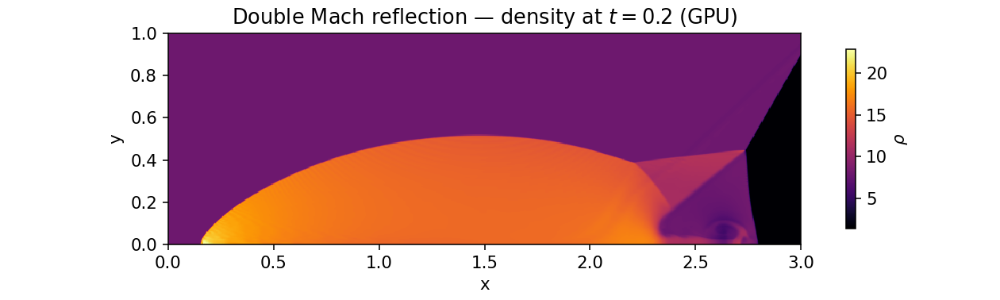

# Double Mach reflection — *verification*

**Objective.** The double Mach reflection (Woodward & Colella) is the standard
**strong-shock** stress test: a Mach-10 shock striking a 30° wedge produces the
incident/reflected/Mach-stem shocks meeting at a **triple point**, with a
slip-line jet rolling up along the wall. There is no closed-form solution, so
this is a **verification** case: (1) the GPU path advances in **lock-step** with
the validated CPU reference; (2) the hierarchy is bit-close through **2-level**
(`AmrGpu`) and **3-level** (`AmrGpuML`) subcycled AMR; (3) the declarative
`CaseDef` ghost fill reproduces the analytic moving-shock BC **cell-for-cell**.

## Numerical setup
> MUSCL-Hancock + HLLC, CFL 0.4, domain 4 × 1, t = 0.2, the classic Mach-10
> reflected-shock inflow (`dmr::fillGhosts`). Field shown: **GPU**, 960 × 240.
> Lock-step gates compare `Euler2DGpu` / `AmrGpu` / `AmrGpuML` against the CPU
> `Grid` / `Amr2` / `AmrML` on the same dt sequence. Drivers: `dmr_gpu`,
> `dmr_amr`, `mlgpu_amr`, `casedef_test`. float32.

## Results

The density field shows the textbook structure: the Mach stem normal to the
wall, the reflected shock, the triple point, and the wall jet curling under the
contact — resolved on the refined patches.

| Gate | Test | Result |
|---|---|---|
| GPU lock-step (uniform) | max rel. diff CPU↔GPU | 9.774e-06 (gate 1e-2); 4.2× speedup |
| AMR lock-step (2-level) | max rel. diff CPU↔GPU | 4.660e-06; work 34 % of uniform 1/256 |
| AMR lock-step (3-level) | max rel. diff CPU↔GPU | 1.177e-04 |
| 3-level periodic KH (GPU) | closed-domain mass drift | 2.629e-08 (gate 1e-6) |
| CaseDef DMR ghosts | vs preset, differing cells | 0 (gate 0) |

## Discussion
The GPU reproduces the CPU reference to **9.774e-06** (fp32 sum
reassociation) at a **4.2× speedup**, and the agreement
holds through the full AMR machinery — 2-level and 3-level subcycled hierarchies
stay bit-close to the CPU AMR with **identical per-level patch counts**, so the
GPU refluxing / restriction / prolongation are exact copies of the validated
CPU path. AMR does the DMR at 1/256 for only **34 %** of
the uniform-grid cell-steps. The `CaseDef` gate closes the declarative loop: the
parsed analytic moving-shock BC reproduces the hand-written `dmr::fillGhosts`
**cell-for-cell** (0 differing). This is the case the
[conservation](conservation.md) fiche's periodic KH complements on the
GPU-lock-step / mass-drift axis.

---
*Part of the [V&V dossier](../README.md). Regenerate: `python3 vv/generate.py`. Source data: [`../data/`](../data/).*
