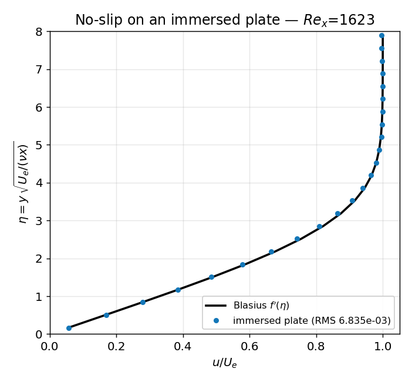

# Immersed boundaries — *validation & verification*

**Objective.** Validate the staircase immersed-solid treatment (solid mask +
mask-aware fluxes threaded through `step2D` and the whole AMR chain) on four
fronts: (1) a **planar shock reflecting on an immersed wall** — the
post-reflection wall pressure has an *exact* 1D value (sub- and supersonic
incident); (2) the **declarative** path (a `[solid]` region parsed from
`cases/shock_wall.ini` run through the real runner); (3) the same reflection
**with AMR** (2-level, subcycled, 3-level) — wall pressure preserved through
restriction / reflux / prolongation / body-edge tagging; (4) a **no-slip
viscous** boundary layer — Blasius on a plate posed *by the mask* (not a domain
BC) — and (5) **CPU↔GPU lock-step** on an immersed Mach-2 cylinder.

## Numerical setup
> MUSCL-Hancock + HLLC, reflective wall flux inside the masked cells. Shock
> reflection: Ms = 2 (subsonic) / 3 (supersonic), exact 1D reflected pressure.
> No-slip: M ≈ 0.25, μ = 1.2e-4, plate from x = 0.2, Blasius by RK4. GPU:
> `AmrGpu` vs the validated CPU `Amr2` in lock-step (same dt). Drivers:
> `immersed`, `immersed_case`, `immersed_amr`, `immersed_noslip`,
> `immersed_gpu`. float32.

## Results

| Gate | Test | Result |
|---|---|---|
| shock | wall pressure vs exact 1D (declarative) | err 0.33 % (gate 5 %), non-penetration \|u\|→0 |
| AMR | wall pressure, AMR vs base | 0.19 % (gate 2 %), exact within 5 % |
| no-slip | profile RMS(u/Ue − f′) | 6.835e-03 (gate 3e-2); wall slip 0.057; Cf within 3 % |
| GPU | CPU↔GPU lock-step, max rel. error | single 5.943e-04, 3-level 7.458e-04 |

## Discussion
The reflected-shock wall pressure lands within a few tenths of a percent of the
exact 1D value for **both** a subsonic and a supersonic incident shock, and the
declarative `[solid]` path reproduces it — validating the full chain from INI
parsing through `solidAt()` to the mask-aware step. Turning on AMR keeps the
wall pressure within 0.2 % of the base-grid run across 2-level, subcycled and
3-level hierarchies, proving the mask survives restriction, refluxing and
body-edge tagging. The **no-slip** case is the strongest: a boundary layer
grown entirely by the mask reproduces the Blasius profile to
**RMS 6.835e-03** with wall slip 0.057
and skin friction within 3 % of 0.664/√Re_x — the
mask-aware viscous flux is doing real physics, not just blocking flow. Finally
the GPU path advances in lock-step with the CPU reference to ~1e-3 (fp32 sum
reassociation), locking the Metal port of the mask. Complements the
[oblique-shock wedge](wedge.md), which is itself an immersed body.

> WENO5 is incompatible with immersed solids (hard error) — the immersed path
> is MUSCL-Hancock only.

---
*Part of the [V&V dossier](../README.md). Regenerate: `python3 vv/generate.py`. Source data: [`../data/`](../data/).*
