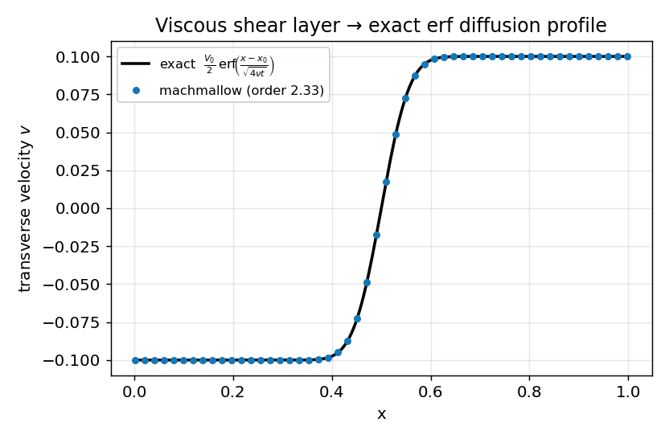

# AMR & GPU infrastructure — *verification*

**Objective.** Verify the parallel/adaptive machinery itself, independently of
any single physics case: (1) the multi-level engine `AmrML` reproduces the
battle-tested 2-level `Amr2` **bit-for-bit**; (2) **velocity-based tagging**
refines a uniform-density shear layer that the density criterion cannot see;
(3) **closed-domain conservation** on doubly-periodic AMR (wrapped ghosts +
wrapped refluxing) sits at the float32 floor; (4) **checkpoint round-trip** is
exact; (5) the **GPU** viscous path converges to an exact solution and stays in
lock-step with the CPU. The anchor solution is the viscous shear layer, whose
transverse velocity obeys the heat equation exactly: $v = \tfrac{V_0}{2}
\,\mathrm{erf}\!\big((x-x_0)/\sqrt{4\nu t}\big)$.

## Numerical setup
> MUSCL-Hancock + HLLC, CFL 0.4. Shear: μ = 5e-3, exact erf IC diffused
> t = 0.05 → 0.20, order from 64/128/256, GPU parity in lock-step. Multi-level:
> 3-level subcycled Sod & periodic KH. Tagging/conservation: doubly-periodic KH
> with a uniform-density shear layer. Drivers: `ml_amr`, `kh_amr`, `shear`.
> float32.

## Results

| Gate | Test | Result |
|---|---|---|
| `ml_amr` 1 | AmrML(2) vs Amr2, 100 steps | max rel diff 0.000e+00 (bit-exact) |
| `ml_amr` 2/3 | 3-level Sod L1 ratio / periodic KH drift | 1.43 / 2.390e-08 |
| `kh_amr` | velocity tagging (vel / density-only) | 32 / 0 patches |
| `kh_amr` | periodic mass drift / checkpoint round-trip | 2.781e-08 / 0.000e+00 |
| `shear` | viscous order / GPU parity | 2.33 / 9.577e-06 |

## Discussion
The multi-level `AmrML` reproduces the validated 2-level `Amr2` to **exactly
zero** difference over 100 subcycled steps — the deeper hierarchy adds levels
without perturbing the established path. Velocity tagging refines the shear
layer that is **invisible** to the density criterion (32
patches tagged on velocity, 0 on density), and the
doubly-periodic domain conserves mass to the float32 floor through wrapped
ghosts and wrapped refluxing. The checkpoint round-trip is **bit-exact**
(40+40 vs 80 steps). On the GPU, the viscous shear converges to the exact erf
at order **2.33** and matches the CPU to
9.577e-06. These are the invariants every physics case
above silently relies on — the [conservation](conservation.md),
[Sod-on-AMR](sod_amr.md) and [DMR](dmr.md) fiches are the same machinery under
load.

---
*Part of the [V&V dossier](../README.md). Regenerate: `python3 vv/generate.py`. Source data: [`../data/`](../data/).*
