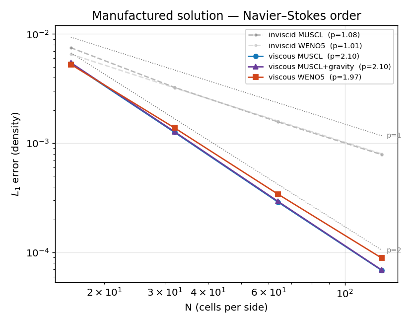

# Manufactured solution (MMS) — *verification (Navier–Stokes order)*

**Objective.** Verify the **viscous Navier–Stokes** operator converges at its
design order 2. A smooth steady solution is imposed with an exact source term
$S = \nabla\!\cdot F_{\rm Euler} - \nabla\!\cdot F_{\rm visc}$; the
discrete L1 error must then fall as $O(h^2)$. This is the only gate that pins
the **viscous** operator's order (the
[order-of-accuracy](order_of_accuracy.md) fiche covers the inviscid transient
order).

## Numerical setup
> Smooth periodic manufactured solution (sinusoidal ρ,u,v,p), source computed
> **in double** by 4th-order finite differences and injected each step. Relax
> to steady state, measure L1(ρ) vs the manufactured field, N = 16 → 128,
> μ = 0.01, CFL 0.4. Schemes MUSCL & WENO5 (+ a gravity-source variant).
> Driver: `mms`. float32.

## Results

| Operator | Observed order |
|---|---|
| viscous, MUSCL | 2.10 |
| viscous, WENO5 | 1.97 |
| viscous + gravity, MUSCL | 2.10 |

## Discussion
Both schemes reach order **~2** on the viscous operator — capped at 2 by the
**central 2nd-order viscous flux** (shared by MUSCL and WENO5), exactly as
expected, so the full Navier–Stokes discretization is verified at order 2. The
gravity-source variant stays at 2 (a sign or work-term bug would break the
steady state and the order). The faint **inviscid** curves sit at ~1: with no
physical viscosity the steady-state error is set by the scheme's *numerical*
viscosity (1st order on this solution) — that is **not** the transient design
order (MUSCL ~2, WENO5 ~4–5), which the order-of-accuracy fiche verifies by
advecting an exact solution.

---
*Part of the [V&V dossier](../README.md). Regenerate: `python3 vv/generate.py`. Source data: [`../data/`](../data/).*
