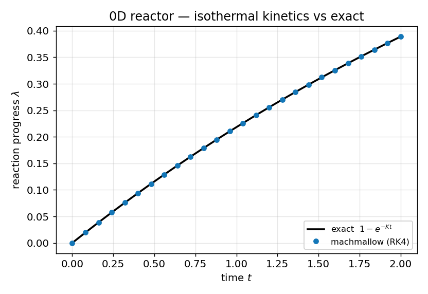

# 0D reactor kinetics — *verification vs analytic*

**Objective.** Verify the stiff Arrhenius reaction integrator against exact 0D
solutions *before* it is coupled to the flow: (1) **isothermal** (q=0) → exact
exponential; (2) **adiabatic** → full burn to λ=1 with T rising by exactly
(γ−1)q and exact energy balance; (3) **very stiff** → the subcycling stays
bounded and still reaches equilibrium in one coarse step.

## Numerical setup
> Single-step Arrhenius reaction, adaptive **subcycled RK4**, energy slaved to
> the progress variable ($e = e_0 + q\,\Delta\lambda$, conservative by
> construction). Constant-volume 0D integration. Driver: `reactor`.

## Results

| Test | Result |
|---|---|
| isothermal, λ vs $1-e^{-Kt}$ | err 8.403e-08 (gate 1e-5) |
| adiabatic, equilibrium T | 5.20000 vs 5.20000 exact; energy resid 4.768e-07 |
| stiff (A=1e4, dt=1), λ | 1.000000 (bounded, equilibrates) |

## Discussion
The isothermal case (constant rate K) reproduces the exact exponential to
~1e-7 (curve). The adiabatic burn reaches λ=1 with the temperature rising by
exactly (γ−1)q and energy conserved to ~5e-7 — the energy-slaving makes the
integrator conservative by construction. The stiff case (A=1e4 in a single
coarse step) stays bounded and equilibrates, showing the adaptive subcycling
handles stiffness. This 0D validation underpins the coupled
[CJ detonation](detonation.md) case.

---
*Part of the [V&V dossier](../README.md). Regenerate: `python3 vv/generate.py`. Source data: [`../data/`](../data/).*
