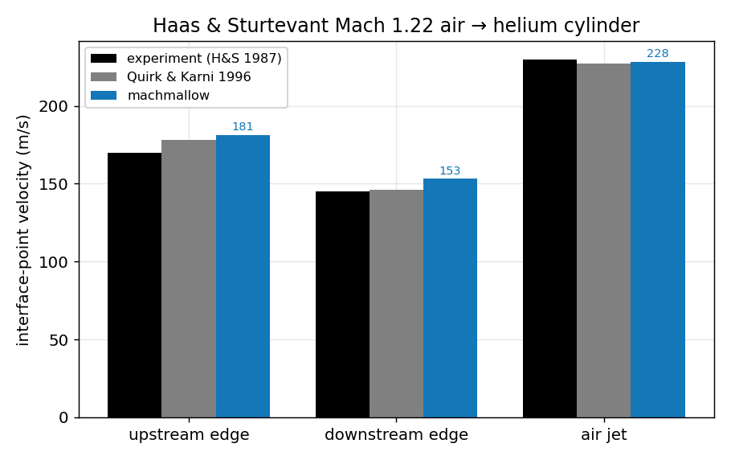

# Shock–bubble (Haas & Sturtevant) — *validation vs experiment*

**Objective.** The most demanding validation in the dossier: reproduce the
**experimental** interface dynamics of Haas & Sturtevant (1987) — a **Mach
1.22** shock in air striking a cylinder of (contaminated) **helium** — and
compare the early-time velocities of the three characteristic interface points
against both the experiment and the canonical numerical reference,
Quirk & Karni (1996).

## Numerical setup
> Two-gas (air γ 1.4 | contaminated-helium γ 1.645, ρ ratio 0.182), **3-level
> subcycled AMR on GPU** (`AmrGpuML`), density + velocity tagging, domain
> 2 × 1, finest 1/256. Post-shock inflow left, reflective tube walls. Interface
> tracked as the Y = 0.5 axis crossings; each velocity is a least-squares slope
> over the phase window the experiment measures. Driver: `hs_suite`. float32.

## Results

| Interface point | Experiment | Quirk & Karni | machmallow | Δ vs exp |
|---|---|---|---|---|
| upstream edge | 170 m/s | 178 m/s | 181 m/s | +6.7 % |
| downstream edge | 145 m/s | 146 m/s | 153 m/s | +5.6 % |
| air jet | 230 m/s | 227 m/s | 228 m/s | -0.7 % |

## Discussion
All three characteristic velocities land **within ±10 %** of the experimental
values and sit right alongside Quirk & Karni's computed numbers — the upstream
edge and downstream edge slightly fast (consistent with the contaminated-helium
model and the ±measurement uncertainty H&S report), the **air jet within 1 %**.
Recovering an *experimental* dataset — not just an exact solution — with a
two-gas, GPU, multi-level-AMR run is the end-to-end validation that the species
transport, the shock–interface interaction and the adaptive refinement all work
**together**. The two-gas machinery itself is unit-validated against exact
Riemann solutions in the [multi-species fiche](species.md).

---
*Part of the [V&V dossier](../README.md). Regenerate: `python3 vv/generate.py`. Source data: [`../data/`](../data/).*
