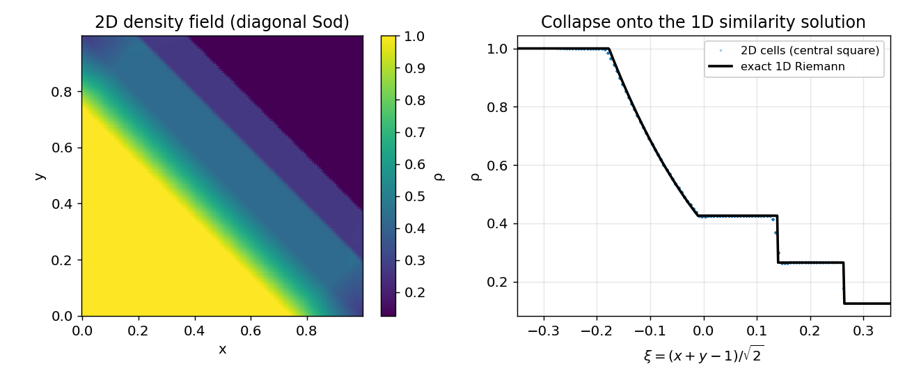

# Diagonal 2D Sod — *validation + isotropy*

**Objective.** Run the Sod problem **diagonally** across a 2D grid. The exact
solution depends only on $\xi = (x+y-1)/\sqrt2$, so the 2D field must
**collapse** onto the 1D Riemann solution — testing the 2D scheme *and* its
isotropy (no grid-alignment bias) at once.

## Numerical setup
> MUSCL-Hancock + HLLC, **uniform 2D grid** (no AMR), inviscid Euler, CFL 0.4,
> t = 0.15, transmissive on all sides. Grid-convergence N = 64, 128, 256 on
> the central (boundary-free) square. Reference = exact Riemann in $\xi$.
> Driver: `sod2d`. float32.

## Results

Mean grid-convergence order (L1 density, central square): **0.97**
(≈1, discontinuous solution).

## Discussion
Every cell of the 2D field lands on the exact 1D curve when plotted against
$\xi$ (right panel) — the scheme is **isotropic** (a 45° shock is captured
like an axis-aligned one) and matches the exact Riemann solution. Order ~1 is
the expected discontinuity-limited rate, consistent with the 1D Sod fiche.

---
*Part of the [V&V dossier](../README.md). Regenerate: `python3 vv/generate.py`. Source data: [`../data/`](../data/).*
