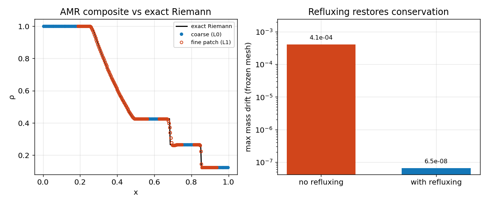

# Sod on AMR — *verification: refluxing + accuracy*

**Objective.** Run Sod on a 2-level AMR hierarchy and check two things:
(1) **conservation** — the Berger–Colella *refluxing* must cancel the
coarse/fine flux mismatch (mass drift at the float32 floor); (2) **accuracy**
— the composite L1 must match a uniform-fine run, for a fraction of the work.

## Numerical setup
> MUSCL-Hancock + HLLC, **2-level AMR** (coarse 128×32 → fine 256×64, ratio 2),
> inviscid Euler, CFL 0.4, t = 0.2. The refluxing test uses a **frozen** mesh
> refined around the initial discontinuity, so the shock, contact and
> rarefaction all cross the coarse/fine interfaces. Driver: `sod_amr`.

## Results

The **left panel** overlays the AMR composite density on the exact Riemann
solution: the coarse cells (blue) carry the smooth regions, while the fine
patches (orange) cluster exactly on the shock, contact and rarefaction — and
the whole thing lands on the exact curve.

| Metric | Result |
|---|---|
| mass drift, refluxing **on** (frozen) | 6.478e-08 |
| mass drift, refluxing **off** (frozen) | 4.067e-04 (**6279× worse**) |
| composite L1 vs exact / uniform-fine | ratio 1.00 (gate 1.4) |
| work vs uniform fine | 63 % of the cell-steps |

## Discussion
**What is refluxing?** At a coarse/fine interface the coarse cell and the
adjacent fine cells each compute the flux through the *shared* face
independently — at different resolutions, so the two disagree. Left
uncorrected, that mismatch adds or removes mass (and momentum/energy) at the
interface every step, breaking conservation. **Refluxing** (Berger–Colella)
fixes it: after the fine level advances, the coarse flux through the shared
face is *replaced* by the sum of the fine-face fluxes, so the interface
becomes conservative to machine precision.

The right panel is the proof: with a frozen coarse/fine interface swept by all
three waves, turning refluxing **off** leaks mass **6279× more**; with
it **on**, the drift sits at the float32 floor. Meanwhile the AMR composite is
**as accurate** as the uniform-fine grid (L1 ratio ≈ 1) for only ~63 %
of the cell-steps — the whole point of AMR.

---
*Part of the [V&V dossier](../README.md). Regenerate: `python3 vv/generate.py`. Source data: [`../data/`](../data/).*
