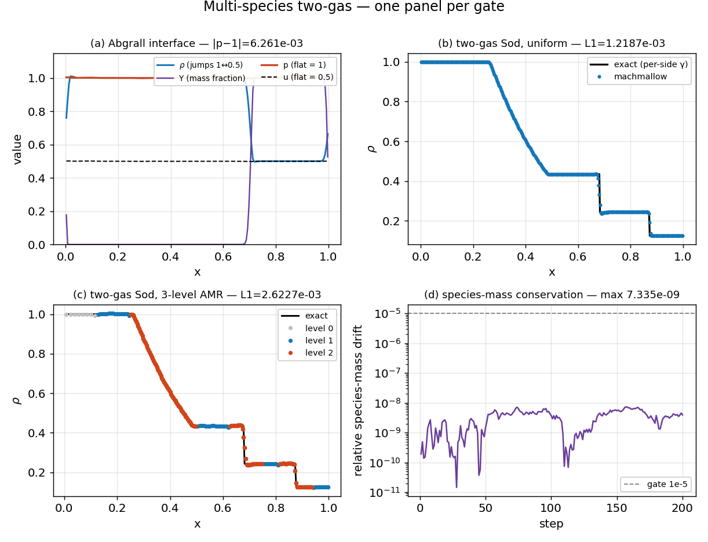

# Multi-species two-gas — *validation vs exact*

**Objective.** Validate the two-gas core (per-cell γ transported with the
species mass fraction): (1) the **Abgrall material-interface** test — a ρ+γ
jump advected in a uniform p, u field must keep **pressure and velocity flat**
(the discriminating test that naive conservative multi-gas schemes fail with
spurious pressure oscillations at the interface); (2) a **two-gas Sod**
(γ 1.4 | 1.6) vs the generalized per-side exact Riemann solution, uniform and
on **3-level AMR**; (3) species-mass conservation at the float32 floor.

## Numerical setup
> MUSCL-Hancock + per-side HLLC with a **quasi-conservative γ transport**
> (`Muscl2DSpecies`), CFL 0.4. Interface: periodic, u = 0.5, one full period
> (N = 200). Two-gas Sod: transmissive, t = 0.2, N = 400 (uniform) and a
> 3-level subcycled AMR hierarchy. Driver: `species_suite`. float32.

## Results
The four panels below map one-to-one to the four gates in the table.

| # | Test | What the panel shows | Result |
|---|---|---|---|
| a | **Abgrall interface** | a ρ/γ jump advected at u = 0.5; p (ember) and u (dashed) must stay flat while ρ (cyan) and Y (purple) jump | \|p−1\| 6.261e-03 (gate 1e-2); max\|u−0.5\| 4.266e-03 |
| b | **two-gas Sod, uniform** | density at t = 0.2 (dots) over the generalized exact Riemann solution (line) | L1(ρ) 1.2187e-03 (gate 6e-3) |
| c | **two-gas Sod, 3-level AMR** | the composite density, each cell coloured by its refinement level, over the exact solution | L1 2.6227e-03 (gate 5e-3) |
| d | **species-mass conservation** | relative drift of ∫ρY over 200 steps vs the 1e-5 gate | max 7.335e-09 (gate 1e-5) |

## Discussion
**(a) Abgrall interface.** This is *the* discriminating multi-gas test. A naive
fully-conservative scheme develops spurious **pressure oscillations** at a
contact where γ jumps, because a conservative update of total energy is
inconsistent with a uniform pressure when the equation of state changes across
the face. The panel shows pressure and velocity staying flat to
**6.261e-03 / 4.266e-03** while ρ and Y
advect as a clean top-hat — the quasi-conservative γ transport passes. A tiny
bounded wiggle remains (conservative-variable reconstruction; primitive-variable
reconstruction is the documented next refinement) but it is well under the gate
and does not grow. The wrap-around feature at x = 0/1 is the periodic seam of
the advected slab, not an artefact.

**(b) two-gas Sod, uniform.** With a real γ 1.4 | 1.6 jump the exact Riemann
solution keeps a **different γ on each side of the contact**; the computed
density overlays it (L1 1.2187e-03), so the per-side HLLC and
the Γ transport are consistent through a genuine shock/contact/rarefaction.

**(c) two-gas Sod on 3-level AMR.** The same problem through the full adaptive
machinery: the colouring shows the base grid (grey) coarsening away from the
structure while levels 1–2 (cyan/ember) track the contact and shock. The
composite still lands on the exact solution (L1 2.6227e-03) —
species reconstruction, per-side HLLC and refluxing all compose correctly
across coarse–fine interfaces.

**(d) species-mass conservation.** ∫ρY drifts by at most
**7.335e-09** over 200 steps — the float32 floor — confirming
the scalar φ = ρY is transported conservatively.

The same two-gas path is re-exercised under **WENO5** in the
[WENO5 suite](weno.md) (gates 7–8) and end-to-end against **experiment** in the
[Haas–Sturtevant shock–bubble](shock_bubble.md).

---
*Part of the [V&V dossier](../README.md). Regenerate: `python3 vv/generate.py`. Source data: [`../data/`](../data/).*
