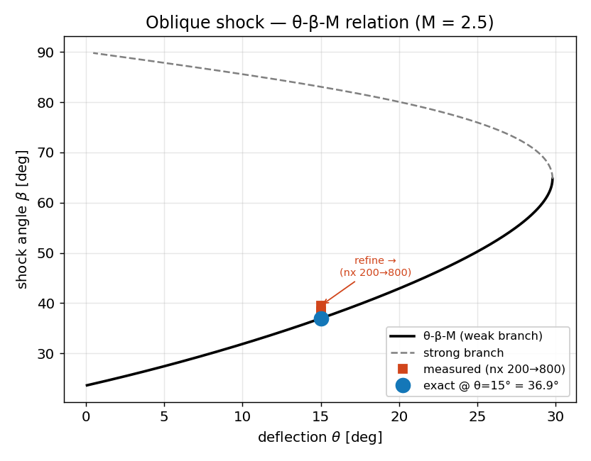

# Oblique shock — *validation vs θ-β-M*

**Objective.** A Mach 2.5 stream over a 15° wedge (an **immersed** body on the
Cartesian grid) forms an attached oblique shock. Its angle β must obey the
exact **θ-β-M** relation (Anderson, perfect gas).

## Numerical setup
> Uniform stream M = 2.5 over a 15° ramp declared as a **solid mask** (ghost-
> cell / staircased immersed boundary), MUSCL-Hancock + HLLC (exact wall-
> pressure flux), CFL 0.4, inflow left / transmissive right & top / reflective
> floor. β measured by detecting the density jump at several heights and a
> least-squares fit of the shock line. Driver: `immersed_wedge` (resolution
> knob `immersed_wedge <nx>`). float32.

## Results

| Grid $n_x$ | β measured | β exact | error |
|---|---|---|---|
| 200 | 39.49° | 36.94° | 2.55° |
| 400 | 38.33° | 36.94° | 1.38° (gate 2°) |
| 800 | 37.52° | 36.94° | 0.57° |

## Discussion
The measured β sits slightly **above** the exact weak-branch value and
converges toward it as the grid is refined (2.55° → 0.57°). The residual is
the **staircase** representation of the ramp on the Cartesian grid — the same
finite-resolution boundary error seen in Blasius, and the reason *cut-cells*
are on the roadmap. The same driver also checks the wall pressure (C_p within
0.8 % of the exact oblique-shock $p_2$) and zero lift on a symmetric cylinder
(|F_y/F_x| < 1e-3).

---
*Part of the [V&V dossier](../README.md). Regenerate: `python3 vv/generate.py`. Source data: [`../data/`](../data/).*
