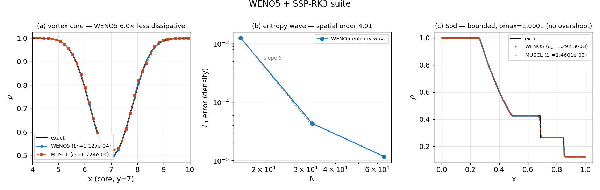

# WENO5 scheme suite — *verification*

**Objective.** Validate the fifth-order WENO5 + SSP-RK3 scheme end to end and
quantify what it buys over the default MUSCL-Hancock: smooth-flow order, the
absence of spurious oscillations on the Sod shock, the **head-to-head
dissipation** on an isentropic vortex, the viscous flux against an exact `erf`
diffusion layer, two-gas Riemann, and bit-exact behaviour through the AMR
stage-ghost machinery.

## Numerical setup
> **WENO5 reconstruction + 3-stage SSP-RK3**, LLF/HLLC faces, CFL 0.4, on
> uniform grids and (gates 4/5/8) the multi-level AMR. Each smooth test is run
> head-to-head against **MUSCL-Hancock** on the identical grid. References:
> exact advection (entropy wave, vortex), exact Riemann (Sod, two-gas), exact
> `erf` (viscous shear). Driver: `weno_suite`. float32.

## Results
Three of the eight gates are illustrated (the rest are lock-step / conservation
numbers in the table): **(a)** the vortex-core dissipation vs MUSCL, **(b)** the
smooth entropy-wave high-order convergence, **(c)** the Sod tube boundedness.

In **(a)**, at $64^2$ the vortex core is resolved by WENO5 down to the exact
density dip while MUSCL-Hancock over-diffuses it — an $L_1$ dissipation ratio of
**6.0×** (gate: WENO < MUSCL/4). In **(b)** the entropy
wave converges along the **slope-5** guide in the spatial-limited regime
(before RK3 floors the total). In **(c)** the Sod density stays inside the exact
extrema (ρmax 1.0001) — no spurious over/undershoot.

| Gate | Test | Result |
|---|---|---|
| 1 | smooth entropy wave, spatial order | 4.87 (spatial 8→16: 4.01; gate ≥ 4) |
| 2 | Sod tube, L1 vs exact + boundedness | WENO 1.2921e-03 vs MUSCL 1.4601e-03; no over/undershoot |
| 3 | **isentropic vortex, dissipation vs MUSCL** | WENO 1.127e-04 vs MUSCL 6.724e-04 (**6.0×**, order 2.21) |
| 4 | all-refined 2-level = uniform, bit-exact | 0 differing values (gate 0) |
| 5 | Sod on 3-level AMR vs MUSCL | WENO 4.2711e-03 vs MUSCL 3.1071e-03 (gate < 2×) |
| 6 | viscous shear (erf) order | 2.15 (gate ≥ 1.8) |
| 7 | two-gas Sod (uniform) L1 | 1.4870e-03 (gate 4e-3) |
| 8 | two-gas Sod on 3-level AMR | L1 4.0930e-03, species drift 3.346e-06 |

## Discussion
The entropy wave recovers the design order (~5) in the spatial-limited regime
before the RK3 temporal error floors the total — the expected behaviour at
fixed CFL. On the genuinely-2D vortex the dimension-by-dimension midpoint
quadrature caps the **formal** order near 2, but the error **constant** is what
matters: WENO5 is **6.0× less dissipative** than
MUSCL-Hancock at the same resolution, which is exactly the payoff on smooth
turbulent structures. On the Sod shock WENO5 stays in MUSCL's error class with
no spurious extrema (HLLC faces are hard to beat on a single discontinuity).
Gate 4 is the strongest correctness check: a fully-refined non-subcycled
hierarchy reproduces the uniform fine grid **bit for bit**, proving the
per-stage ghost machinery is exact. Two-gas Riemann (uniform and 3-level AMR)
and the exact-`erf` viscous layer close the loop on the species and viscous
paths. WENO5 is single-gas-per-cell and **incompatible with immersed solids**
(hard error), by design.

---
*Part of the [V&V dossier](../README.md). Regenerate: `python3 vv/generate.py`. Source data: [`../data/`](../data/).*
